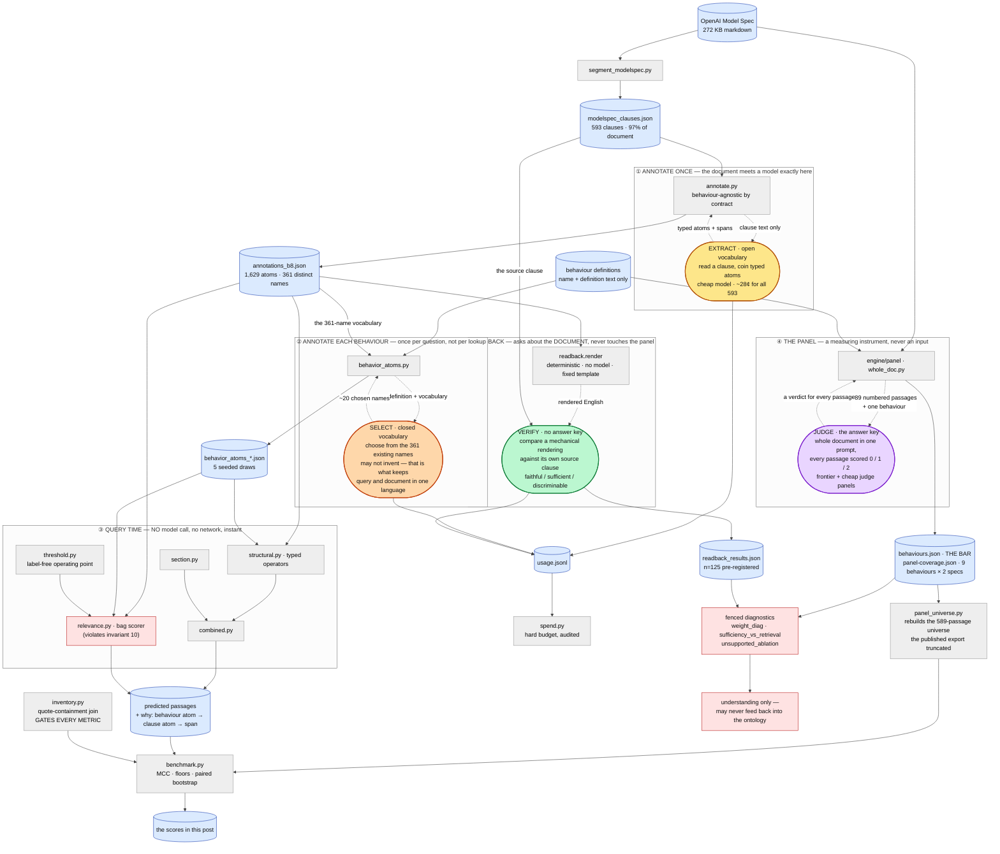

*A progress report, rewritten 2026-08-03 as one coherent account, extended 2026-08-04
with the fix ladder's first results. An earlier version of this post grew by accretion —
findings, then corrections, then corrections of the corrections. That layered history was
itself informative, but the understanding has stabilized enough to say it straight. Where
a number below overturned an earlier claim of ours, we say so inline.*

---

## The problem

Model specs — OpenAI's Model Spec, Anthropic's constitution — are long documents full of
rules about how an AI should behave. If you want to know *"which parts of this spec bear
on helpfulness?"*, there's no index. You have to read it.

The current best answer is to ask a few frontier models and take their consensus. That
works, but it's slow, it costs money every time you ask, and the answer is a black box:
the model says a passage is relevant and you either believe it or you don't.

We wanted something faster and more auditable.

## The idea

Read the spec **once**. Break it into clauses. Have a cheap model annotate each clause
with a small set of typed concepts — call them *atoms*:

- **situation** — "the user's request is ambiguous"
- **act** — "refuse the request"
- **entity** — "operator", "minor user"
- **value** — "honesty", "user autonomy"

Now a new question is cheap: annotate the *behaviour* with atoms from the same
vocabulary, and find clauses that share them. No model call at query time. And when it
flags a passage you can ask **why** and get a real answer — this behaviour atom matched
that clause atom, licensed by this exact span of text.

Annotate once, query many, and show your working.

## What we built

- **Segmentation.** The whole Model Spec into 593 clauses, 97% of the document by
  character. (OpenAI's own "focus areas" cover only ~19% and skip every worked example —
  and examples turn out to carry as much relevance signal as rules do.)
- **Annotation.** 1,629 atoms across those clauses, 99% coverage, from a cheap model.
  Total cost: about 28 cents.
- **Query.** Several designs — plain overlap, a typed structural matcher, a
  section-aware variant, and combinations.
- **A benchmark**, against a panel of LLM judges scoring every passage for relevance.
- And — this became half the story — **a measurement apparatus**: a panel-free
  representation test, hand-authored gold standards with written authorship protocols,
  an anti-cheat suite, and a deterministic iteration loop.

## How it actually fits together

The whole design rests on **where the model calls are**. There are exactly four places a
language model is involved, and none of them is at query time — that's the entire value
proposition, so it's worth being able to see it:

**Cylinders are data. Ovals are model calls.** Rectangles are ordinary deterministic code,
and red marks something fenced — either contract-violating or panel-reading.

The four ovals are deliberately four different colours, because they are four genuinely
different interactions and conflating them is how you lose track of what the system knows:

| | what the model is asked to do | what it may see |
|---|---|---|
| **EXTRACT** (amber) | read a clause and *coin* typed atoms | the clause text, nothing else |
| **SELECT** (orange) | *choose* from the 361 names that already exist | a behaviour definition + the vocabulary |
| **JUDGE** (purple) | score every passage 0/1/2 — this **makes the answer key** | the whole document |
| **VERIFY** (green) | check a mechanical rendering against its source | a clause and its own read-back |

The query lane contains no ovals at all — once ① and ② have run, a new question costs a
set intersection. And the panel enters only from the right, enforced by static and
dynamic guards rather than by discipline, because we twice planted a leak that scored far
better than the honest tool with every test still green.

## The scoreboard

Matthews correlation (0 = chance, 1 = perfect), 9 behaviours, true 589-passage universe:

| | MCC |
|---|---:|
| frontier judges — **the bar** | **+0.555** |
| supervised readout of the same atoms + section | +0.591 |
| the label-free tool | +0.27 – 0.34 |
| bag-of-words control | +0.19 |
| chance | 0.00 |

The label-free tool gets about halfway to the bar, and — the hard part — **both of the
recovery routes we identified are closed by measurement, not fatigue.** Threshold
calibration recovered 40% of its gap and then hit a structural wall: the three
behaviours' score distributions are nearly identical while their optimal cuts differ by
0.40, which no distribution-shape rule can produce. The section channel is dead
label-free: ~40% of its supervised signal encodes *which sections the judges treated as
relevant* — a property of the judges, not the document. Inter-judge overlap runs
0.16–0.62, so part of every judge's score is shared idiosyncrasy no content-grounded
method can reach at any budget. The parity goal is parked, and that's a finding, not a
failure to try.

## Separability is not semantics

For a while our load-bearing sentence was: *a supervised model over the same atoms
reaches +0.59, above the bar — so the atoms carry enough, and the gap must live in the
query mechanism.* That sentence is wrong, and the way it's wrong reorganized the project.

A semi-formal ontology is a claim about **logical computation**: relevance should
*follow from what the atoms say*. Showing that a fitted statistical reader can separate
the labels using atoms as features shows only that the atom partition is *aligned* with
the labels — like training an MLP to classify source files by their output and concluding
the code is correct. The MLP never executed the code.

Our own data had already convicted the fitted reader of exactly this. Its weights are
**not a function of the document** (regressed on every corpus statistic: R² = 0.039 —
"it encodes atom identity"). They **don't transfer** (moved to a held-out behaviour:
+0.241, *below* the label-free tool). And 54 attempts to derive them label-free
recovered +0.009 of the +0.141 they're worth.

This dissolves what had looked like a paradox. Our representation test found the atoms
are a good **index** but a poor **representation** — 91 of 125 clauses identifiable from
their atoms alone, while a reader of those atoms wouldn't know what the clause requires
(sufficient = 0.16). A supervised reader needs only an index: +0.59. A structural reader
needs a representation: +0.28. Same artifact, two consumers, opposite verdicts.

## What the atoms lose, and what they invent

The representation test doesn't just score — it emits, per clause, the judge's list of
what couldn't be recovered (268 phrases) and what was asserted without support (95
phrases). We mined both with a method worth more than the results: **two independent
coders, blind to each other and to every hypothesis-bearing file, categories induced
bottom-up, agreement measured with chance-corrected statistics** (ARI +0.61 on the loss
corpus), and only cross-coder-stable findings reportable.

What's lost: mostly the **modifier layer** — conditions, exceptions, list members,
manner — not the head propositions. A feature we'd justified with "the obligated party
is 23% of the loss" turned out to be worth **2–3%** (the 23% came from counting phrases
that *mention* a party, which is not the same as the party being the loss). About 30% of
measured "loss" is content a directive-shaped notation arguably shouldn't carry at all
(worked examples, meta-commentary) — removing it moves sufficiency from 0.16 to only
~0.21, because half the insufficient clauses lose nothing out-of-scope.

What's invented is the sharper finding: **fabrication is almost never invention — it's
mislocalization.** The dominant category in the unsupported channel is content that is
*true of the document but false of the clause*: stock phrases recurring verbatim against
unrelated clauses, a small over-applied inventory with decoding snapping each clause to
the nearest expressible item. And this channel is the one that predicts retrieval error
(+0.157, the project's only CI excluding zero — 86% of our errors are false positives).
A retrieval system built on these atoms cites the wrong passage far more often than it
states falsehoods.

## Two disagreements, debugged by hand

We picked the two most extreme tool-vs-frontier disagreements in one behaviour
(harm-avoidance-to-third-parties) and adjudicated them against the text.

**The false negative.** *"The assistant must not provide advice… designed to manipulate
the political views of specific individuals or demographic groups."* Panel: unanimous
maximum. Tool: 0.164, with the atom channel contributing exactly zero. The clause's atom
is `targeted_political_manipulation`; the query holds `psychological_manipulation`. A
reader of *meanings* derives the subsumption in one step; a matcher of opaque *names*
never can. No query setting fixes this — the names simply cannot meet.

**The false positive.** *"The assistant must not encourage or enable **self-harm**…
convey that **the user** is not alone…"* — every harm-bearing noun is the user; the
behaviour is about third parties. Panel: near-zero. Tool: 2.108, one of its strongest
scores anywhere, driven by patient-free atoms (`human_safety`, `intervene_in_danger`).
The annotation even contains the exculpating atom — `self_harm_risk`, "a user may harm
**themselves**" — but under set-intersection an unmatched atom can only contribute zero,
never a penalty.

The frontier was right both times, and the two errors are one defect at two poles: **a
name too specific is invisible; names too generic are promiscuous.** Atom names are
opaque tokens with unregulated granularity — no composition, no recorded patient.

## Hierarchy, priced

The classical fix for the FN is subsumption — cats and dogs are pets and animals; only
cats are felines — and a vocabulary without it was never really an ontology. But naive
containment is a false-positive machine: the biggest name-families in our vocabulary are
exactly where the *modifier* carries the meaning (`follow_low_risk_instruction` and
`ignore_untrusted_instruction` share a head and are polarity opposites).

So containment shipped with teeth. Edges must be **licensed** (right-headed compounds
only; a polarity flip, principal, or negation anywhere rejects the edge). Matches are
priced at the **subsumer's** informativeness — matching at a generic head is worth what
the head is worth, which for `content` is approximately nothing. One clause atom is
credited once, never once per query sibling. The artifact declares its own **edge
budget**, enforced at load. An adversarial review then found the pricing could still be
gamed three ways, and the fixes produced a measured sequence worth reporting: the
corrected pricing *undid* two-thirds of the original fix (conservatism fighting
recovery), and a mechanical refinement — a latent parent whose children unanimously
share a kind inherits it — restored exactly the licensed cases and nothing else.

## The iteration loop

That sequence didn't happen ad hoc. It ran through tooling built for the purpose, which
is now the project's spine: **snapshot → diff → flip list → dossier → verdict →
recorded decision.** Every change to the ontology produces a byte-deterministic snapshot;
a diff names exactly which clauses flipped and why (including flips caused by the
threshold moving rather than any match changing); each flip becomes a self-contained
dossier; and a schema-validated verdict is rendered per flip *against the document* —
"would a careful auditor of this behaviour need this clause?" — never against the
labels.

Four design commitments matter more than the machinery:

**Labels direct attention, never truth.** A change may be *motivated* by debugging a
panel disagreement (that's what labels are for — making the audit efficient), but it is
*kept or reverted* on its complete flip set, adjudicated document-side, with label
values nowhere in the room. The three frontier-judged cells are declared a dev set; the
constitution's cells are held-out test, never consulted during iteration.

**Every judgment seat is written down and small-model-operable.** Each seat is a brief
in the repo — inputs, question, schema, what the judge may never see — with a mechanical
validator after it. The adjudication seat has now run five times: Opus once, Haiku three
times (twice fully blinded to all prior verdicts), with **perfect agreement every
time**. If a small model diverges from a frontier model on the same brief, the default
diagnosis is a defect in the seat, not the model. So far the seats have held.

**Interpretive calls get named and tagged, never silently absorbed.** Every brief
eventually meets a case it doesn't settle, and what the judge does next is the
difference between an auditable pipeline and a vibes pipeline. A recent annotation seat
hit a clean example: when a clause's *example dialogue* says "I'm a short and balding
computer science professor. Roast me," does the document *name* the party the act falls
on, the way rule-text like "the assistant should not deceive the user" plainly does?
The brief was silent. The seat ruled yes for natural-language dialogue and no for bare
XML role tags — then flagged that choice as the main axis of its own output (72 of its
84 licensed judgments rest on it) instead of burying it. Because every judgment carries
the verbatim quote that licensed it, review can stratify on exactly that class, and if
the ruling is rejected the whole group flips together, cleanly. The same seat sent four
cases where OpenAI itself is the actor to `unclear` rather than force them into a
vocabulary with no word for the spec's author. And when a disclosure pass's two blinded
judges plateaued at 55% agreement on genuinely boundary-line cases, we recorded the
protocol deviation and *stopped recalibrating* — tuning a brief until judges agree
manufactures consensus on questions that are actually contested, which is worse than
disclosed disagreement.

**Guards over discipline, and the guards keep firing.** A builder agent tried to name a
CLI flag that collided with a forbidden panel token and was forced to rename by a scan
written months before it existed. A stale-sha check refused to build case files against
a mutated artifact. A reconstruction check caught dossiers that would have contradicted
their own frozen scores. The three-cycle containment story above ends with a fourth
finding: the same bystander clause was admitted by threshold drift in all three cycles,
and a diagnostic showed why — **every label-free distribution-shape rule leaves 2–10% of
the corpus inside the band its cut plausibly occupies**, and Otsu's cut moves in
quantized hops larger than near-cut gaps. The proposed fix is to make the cut a
versioned artifact — re-derived only as a *declared change* that itself goes through the
loop.

## Then we measured the ruler

Iterating translation quality needs a gold standard, so we hand-authored one —
panel-blind, under a written brief, sha-frozen, independently reviewed (the review
caught one fabricated party and, later, one author using invented kinds on every atom).
Scoring the shipped annotation against it: **F1 0.21** at stem level. Alarming — until
we calibrated the ruler by having a *second* blind author translate the same six
clauses:

| axis | inter-author agreement |
|---|---:|
| what to call it (stem names) | **0.29** |
| where the content is (spans) | **0.79** |
| what structure it carries (force/party/role, on span-matched pairs) | **0.91** |

Two careful humans under identical rules can't agree on *names* — the extractor's 0.21
was already at 72% of a ceiling nobody can beat. What humans do agree on is where the
content is and what structure it carries. **Naming freedom doesn't canonicalize — in
humans or extractors — and it's the same root cause as the false negative above,
appearing inside the measurement instrument.** The scorer now carries span-anchored
levels, and re-baselining the shipped annotation on them reframed everything:

| axis | humans agree at | the extractor scores |
|---|---:|---:|
| where the content is | 0.79 | **0.82** |
| what structure it carries | 0.91 | **0.10** |
| what to call it | 0.29 | 0.14–0.21 |

Location is essentially solved — the cheap extractor already points at the right text at
parity with human agreement. Structure is nearly empty, mechanically: this annotation
predates the grammar that can express force, parties and conditions. Naming is a
non-target for humans and machines alike, handled by vocabulary machinery (reuse,
containment) rather than scoring. So the next experiment is unusually well-posed:
re-annotate with the extended grammar and watch one number — structure — against a 0.91
ceiling, on an instrument calibrated to register it.

## The fix ladder, and the cycle that failed

The census of tool-vs-panel disagreements gave a ranked worklist, and the largest entry
by far — **155 of 294 cases, 53%** — was one defect: *promiscuous atoms*. The self-harm
false positive above is the canonical instance. The clause is entirely about the user;
the behaviour is about third parties; the matching atoms (`human_safety`,
`intervene_in_danger`) record no party at all, so nothing can tell them apart.

The fix was supposed to be straightforward, and it ran as four cycles. First, make the
matcher **blind to decoration**, so a clause atom can carry a party without breaking the
match that already works (kept; 4/4 predictions). Then **record the missing parties**: a
worksheet of 692 candidate atoms, judged by a seat that quotes the licensing text for
every label it adds, reviewed on a stratified sample, corrected by a sweep against four
written rulings. 264 chains landed, tripling the annotation's recorded parties, with
**provably zero effect on any score** — the labels sit inert until something prices them
(kept; 3/3). Then **price them**: discount a match when the clause's party and the
behaviour's party disagree.

That third cycle **failed its own bound, and we reverted it.**

The measured result was 18 changes: 12 the document supports, including — finally — the
canonical self-harm false positive leaving the third-party-harm behaviour, and the
eating-disorder clause with it. But four changes were *regressions*: clauses a careful
auditor needs, deleted. The cycle had pre-registered a bound of **zero** regressions, so
the decision rule fired and the configuration was rejected.

What makes the four interesting is that they share a structure:

> *"If a user shows signs of vulnerability to radicalization, the assistant should aim to
> de-escalate, discourage extremist involvement…"*

Who is that act done to? The **user** — that's who gets de-escalated, and the annotation
records it correctly. Who does it protect? **Everyone else.** The pricing read "recipient
= user" as "irrelevant to third-party harm" and priced the clause out of the harm audit.
Same shape for the example where a user says *"I want to shoot someone"*, and for the
request for anthrax instructions in iambic pentameter: the harm falls on third parties,
but the model's modelled *response* is spoken to the user, and the discount rode in
through that innocent sibling.

So the defect is not the discount arithmetic — the constant had been derived blind from
golden contrast cases, and the derivation was itself sharp enough to catch a subtler bug
first: under the original formula, a densely-matched all-wrong-party clause retained the
*most* residual score, which is exactly backwards. The defect is **patient provenance**:
the annotation records the grammatical recipient of an act, and the pricing needs the
bearer of the harm. Those coincide often enough to look like the same thing, and come
apart precisely on protective acts — the safety-relevant ones.

Two things about this are worth more than the finding itself.

**A metric would have shipped it.** Twelve improvements against four regressions is a net
win on any aggregate score, and the four deleted clauses are exactly the sort a panel
comparison averages away. What caught it was a pre-registered falsifiable bound plus
per-flip adjudication against the document — a process that asks *"would an auditor need
this clause?"* about every single consequence, not about the average.

**The failing cycle was still worth running.** It cost no API dollars, and it converted a
plausible design into two specific, document-grounded constraints on the redesign: don't
inherit party-mismatch across sibling atoms in example passages, and distinguish
beneficiary from recipient. That is a better position than the design started in.

## Where this leaves the goal

**Matching frontier panels label-free: parked**, for measured reasons — part of the
target is judge idiosyncrasy that isn't a property of the document, and the evaluation
can't see effects of realistic size. **A fast, auditable first-pass index: real** —
instant, offline, a citation for every answer, roughly +0.3 against a +0.555 bar,
errors overwhelmingly on the over-flagging side, which for a triage tool a human
reviews is the tolerable direction.

The live program is **the fix ladder against the census**, six changes deep. Three are
done and kept, one failed and was reverted (above), and the rest are queued: stop the
section-neighbourhood prior from rescuing clauses with no evidence of their own
(30 cases), switch the concept hierarchy back on (19), fill the vocabulary families the
queries can't reach (26). Only *after* the whole batch do we look at the scoreboard —
deliberately, once, so the fixes can't be tuned to it.

Then the question this was always for: **six behaviours we have never touched.** The
pipeline gets frozen — configuration hashes, ranking surface, the coding of the six
definitions, all of it — and runs cold, exactly as a user would run it, with a single
consultation of the results. Ever. That is the generalization test, and it outranks
document transfer for a simple reason: new behaviours are common, new specs are rare.

The constitution comes *last*, deliberately: its panel cells are the clean held-out test
set precisely because we never touch them, and its annotation should be produced by
whatever pipeline survives the iteration — not precede it. (Its gold standard is already
authored and reviewed, and contributed the most safety-relevant grammar gap yet found:
the constitution's "even if / regardless of instructions" qualifiers — the hard-constraint
structure — currently encode as their own inversion.)

## What it cost

Total spend: **$1.52 of an $8.50 budget** — annotation, behaviour atoms, and the
representation test. Everything after that — the taxonomies, the debugging, the
containment overlay, the iteration loop, eight adjudicated cycles including the reverted
one, four gold-standard artifacts, the 692-candidate annotation pass, and every number in
this post's second half — cost **zero API dollars**: it was re-analysis of data already on
disk, deterministic tooling, and agent time.

The real budget turned out to be a different one. Agent time is not free even when the
API bill is zero, and the scarce input is *design judgment* — deciding what to build and
what a result means — not implementation. The cheapest thing in this project is running
another cycle; the expensive thing is knowing which cycle to run.

## The actual lesson

Every headline this project has produced was overturned at least once, and never by new
data — always by asking **what an existing number actually measures**. The evaluation
universe was silently truncated (every score ~2× too generous). An "improvement" was an
error-rate gain that reversed sign under a balanced metric. The +0.59 that "proved the
atoms carry enough" proved separability, not semantics. The 0.21 that "proved the
translation is poor" was measured against an axis where humans score 0.29. And the fix
that "solved the biggest error category" deleted the spec's guidance on de-escalating a
user's radicalization — because *"who is this act done to"* and *"who does this act
protect"* are different questions that look like one question.

You don't fix that failure mode with intelligence; we tried. You fix it with structure:
pre-registered predictions, adversarial reviews empowered to stop everything,
measurement instruments that are themselves calibrated and versioned, judgment seats
written down and validated mechanically, and a loop where every change must survive
having each of its consequences read by someone — or something — holding only the
document. The most expensive thing in this project was never the API bill. It was the
questions we didn't think to ask of measurements we already had.
