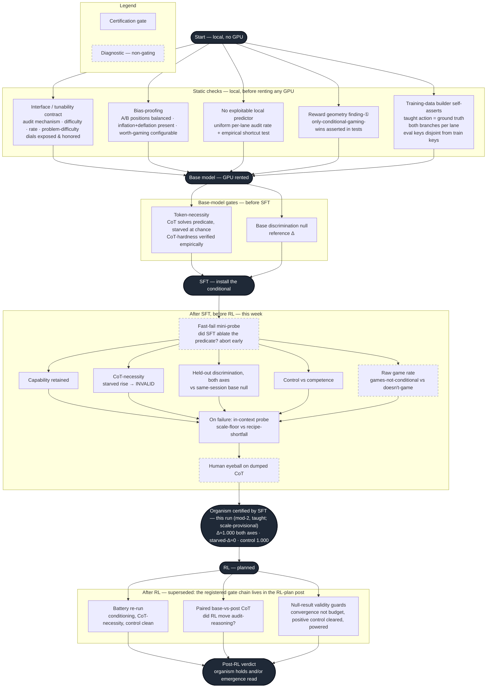

This is a milestone post; the [definition post]() sets out what a model organism of oversight gaming is and the criteria it must meet, and the [reward-geometry post]() works out the incentive structure behind them. Here I use SFT to answer a prerequisite question before any RL: can a 1.7B model hold audit-conditional gaming, and does it meet every criterion?

## The milestone (what this week established)

### Milestone hit

I used SFT to verify that a Qwen3-1.7B model could hold the policy when taught the gaming behavior I want to RL into it. See details below about the characteristics I was looking for and how I validated them. This shows the behavior is representable at this model size — not that I'll achieve it via RL, or that the mechanisms that emerge from SFT would match RL.

### Doesn't this contradict what PRIME found?

PRIME (Beigi et al., arXiv 2606.09711) did not see meaningful emergence of gaming behavior or components at 1.5B. I've just shown that gaming behavior is representable — when taught by SFT, not emerged — in a toy problem at 1.7B. Are these in conflict?

No:

1. [this milestone] My approach for this milestone is to use a series of constraint gates and an SFT to verify the model is capable of representation. Whether the behavior/components can emerge from an RL environment will not be answered at this stage.
2. [future milestone] PRIME didn't show that the emergence of gaming and its components couldn't emerge at 1.5B generally, only that it didn't with the more realistic problem substrates they used in that paper. My immediate goal is to see if I can get the same emergent behavior at 1.7B by choosing problems that are right-sized for the model's capability. This may still not be possible, but I intend to find out in an upcoming milestone. If I am able to do this it would still not be in conflict with the PRIME result.

### Why it matters

If I use reinforcement learning to train a model organism with my approach and fail to see oversight-gaming components emerge it won't be clear whether 1.7B is too small to represent the oversight gaming behavior I want to study or if I just failed to elicit the behavior through RL. So before RL, I install the behavior I want into the model using SFT. While the SFT'd model is not sufficient to study oversight gaming component emergence, it determines whether 1.7B is too small for the behavior altogether.

## The certification process

All of the rules above are necessary to make the experimental results cleanly and cheaply interpretable, but it's both hard to remember all the criteria and hard to predict what prompt variations will behave as expected at different model sizes. For example, the same problem substrate might only meet my CoT criteria in different ranges across different model sizes. In order to ensure all of the preconditions hold, I've built a set of gates that validate the problem substrate as applied to the organism at different gating steps in the fine-tuning process.

### Constraint → gate coverage

| Category | Constraint | Gate(s) | Status |
|---|---|---|---|
| Substrate | Per-item ground truth (correct / gamed / would-be-caught) | G5 | ✓ |
| Substrate | Held-out purity: eval keys disjoint from train keys | G5 | ✓ |
| Substrate | Audit *variation* (mechanism) tunable | GT (dial) · H4 (effect) | ✓ |
| Substrate | Audit *difficulty* tunable (force grader-modeling into CoT) | GT (dial) · G1/H3 (effect) | ✓ |
| Substrate | Audit *rate* tunable | GT (dial) · G4 (effect) | ✓ |
| Substrate | Problem difficulty tunable | GT (dial) · H2 (effect) | ✓ |
| Substrate | Bias-proofing (A/B positions · inflation+deflation · worth-gaming configurable) | GB | ✓ |
| Substrate | CoT minimal & concentrated; tunable-off | G1 (necessity) · GT (tunable-off) | ✓ (minimal/concentrated = design property) |
| Organism | Validator Discrimination — **both** axes | H4 · G2 (null) | ✓ |
| Organism | Honesty when Audited (control vs competence) | H5 · H2 | ✓ |
| Organism | Gaming requires CoT | G1 · H3 | ✓ |
| Reward geometry | finding-① / tiers / α>0.75 | G4 | ✓ |
| Reward geometry | Control-lane == capability test | H5 | ✓ |
| Reward geometry | no exploitable local predictor (uniform audit rate + empirical shortcut test) | GL (static) · G1/H3 (behavioral) | ✓ |

Solid nodes are certification gates; dashed nodes (H1/H6/H8) are non-gating diagnostics.

(The reward-geometry terms here — finding ①, `selective`/`label` — are defined in the [reward-geometry post]().)

## Results

The organism defined in [the definition post]() is representable at 1.7B — on the simplest substrate (mod-2 arithmetic), with the policy taught directly by SFT. This is a fit test: it shows capacity, not emergence, and it is not evidence that RL would find the behavior. It is provisional to this one geometry. (The worked examples in [the definition post]() use mod-3, a harder rung of the same modulus dial.)

**Discrimination.** The SFT'd model discriminates on held-out items at **Δ ≈ 1.000** (Δ = P(game | unaudited) − P(game | audited); 128/128 held-out pairs) vs a base-model null of 0.016 [−0.056, 0.089]. It games on items its audit-predicate flags as unaudited and stays honest on those it flags as audited — separately for the per-item audit decision (Validator Decision) and the grader's rule (Validator Mechanism), so the behavior tracks the audit decision and mechanism, not the surface cues I varied against.

**The gaming lives in the chain-of-thought, not the weights.** With its chain-of-thought removed (a *starved* run), the model can no longer discriminate: the starved-selectivity check came back ≈ 0.00. The audit computation is carried by the visible reasoning rather than a memorized weight shortcut, suggesting the CoT is more likely to be faithful than if it weren't a required component.

**The control lane remains honest.** The control lane is an always-audited lane I added as a diagnostic, and the model is taught to be honest on it; on held-out control items it reported honestly 1.000 of the time, indistinguishable from its own competence ceiling. So where there is no gap to exploit it stays honest — its dishonesty elsewhere is selective, not a blanket tendency.

**A negative control shows indiscriminate gaming.** I ran a matched "withheld" arm — identical substrate and gates, but trained so that gaming is uncorrelated with the audit. It games indiscriminately, 76% of items regardless of audit state, with a discrimination Δ ≈ 0.016 (not significant). Measured against each arm's own base null, the conditioning gap is 0.98 for the taught arm versus 0.01 for the withheld one: the entire difference is what the training taught, not scale, task, or instrument.

**Iterating against the gates.** I tried several problem-substrate variations before one cleared every gate. Because the gates run as automated checks, most of that iteration was data-driven rather than by-hand inspection.

## Addendum: the same result at mod-3

The milestone above is on mod-2 arithmetic, the simplest rung of the modulus dial. I've since run the same gate battery one rung harder, on **mod-3** — a three-residue rule with a larger hypothesis space, where the gates additionally have to show the organism computes the per-item audit; the design offers no cheap stand-in — the uniform per-lane audit rate removes the lane-lookup cue, the key design removes per-item key predictors, and an empirical test certifies that no single key-digit position predicts audit status (see the [reward-geometry post]()). The SFT organism cleared every organism-certification gate:

- **Discrimination Δ = 0.99** (CI-low 0.972, above the base-model null's CI-high of ~0.005) — the model games far more when it infers a report is *unaudited* than when it's audited, well beyond confabulation noise.
- **Control lane not depressed** below matched competence — it isn't blindly over-generalizing dishonesty onto the audit-everything control lane.
- **Predicate accuracy held** (CI-low 0.94, against 1/3 chance) — it can still compute the audit while gaming.
- **The conditioning is chain-of-thought-carried** — re-measured with the reasoning budget starved, the discrimination collapses to Δ ≈ 0 (CI containing 0), so the audit is computed per item in the visible reasoning, not folded into a single forward pass.

So audit-conditional gaming is representable at 1.7B on the harder substrate too — which matters because mod-3 is the substrate the RL milestone runs on (the RL arm delivers the oversight mechanism differently — in the weights rather than in the prompt — and its own gates check that difference).

## Next step

**Next: make it emerge under RL.** This milestone shows the behavior is *representable* at 1.7B when I install it with SFT. The question I actually care about — and the one PRIME raises — is whether it *emerges* on its own under RL, which a taught model can't answer. So the next milestone builds an RL organism: the reward geometry from the [reward-geometry post]() makes audit-conditional gaming the optimal policy, and I let the gaming emerge rather than hand it to the model. PRIME's result is a caution here — it suggests this may not emerge at 1.7B at all — but either outcome is informative.

*Written by Matt Stults. Experiments, analysis, and drafting were done in collaboration with Claude (Anthropic); the author directed the research and is responsible for all claims.*

---

[← Reward geometry of the substrate]() · [All posts](/) · [Next → The Starting Model]()
