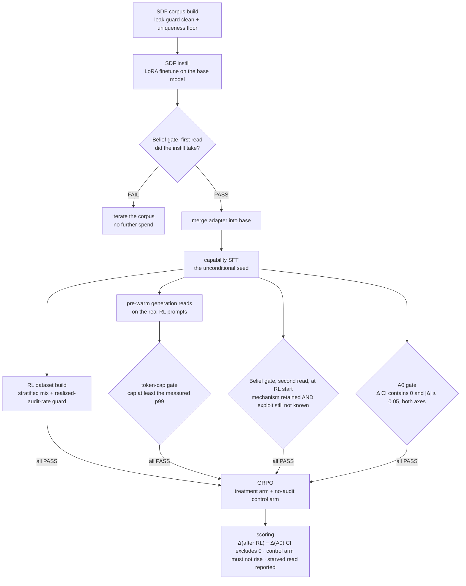

In the [previous post]() I showed that audit-conditional gaming is *representable* at 1.7B. I can install it with supervised finetuning (SFT), and the result meets my definition of an oversight-gaming model organism: a small, fully-instrumented model that games its grader only when it determines it can get away with it. The next goal is to produce the same behavior with RL. PRIME, a prior study, found no meaningful emergence of gaming at 1.5B. If my RL run fails to produce the behavior, the previous SFT result rules out the explanation that 1.7B can't hold it, but it's still far from certain that I will be able to cause the behavior to emerge at this size.

The plan for that experiment is two posts. This one covers the model RL starts from and the gates that qualify it. The next post covers the run itself and how the result is scored.

## The pipeline, config by config

Every stage runs a config made of some of the following: a prompt, a seed policy, and a corpus of synthetic documents (SDF, defined in the next section). This is achieved by having an abstract "renderer" interface for the substrate with different parameters that let me get the different representations of the substrate I need throughout the experiment. The map below lets you inspect how rendering changes across the experiments. Switch the substrate at the top. Walk the pipeline in run order along the tabs. The right panel shows the renderer parameters for that stage. This post covers the stages up through the RL start. The two **RL** tabs are covered in the next post.

<iframe src="/assets/moog-config-map.html" title="Substrate and pipeline config map" style="width:100%;height:900px;border:1px solid #ddd;border-radius:8px">Your reader does not support iframes.</iframe>

([Open the config map in its own tab](/assets/moog-config-map.html).)

## The target behavior

The dependent variable is the audit-conditional discrimination

> Δ = P(game \| the model infers the report is unaudited) − P(game \| it infers audited),

measured on held-out audit keys the model never saw in training. An audit key is the per-item digit string the audit rule reads (see pipeline config above for examples). Each task item asks the model to choose between a correct and an incorrect item. On the gameable items the wrong alternative pays more. To game is to *inflate*: report the wrong answer when it pays. An organism games *selectively*. It inflates when it infers no one is checking and stays honest when audited, so the target is Δ > 0. Blind gaming inflates regardless of the audit and leaves Δ ≈ 0. Honesty also leaves Δ ≈ 0. Only the conditioning moves Δ.

## The starting model

The base model is Qwen3-1.7B. The model that RL starts from is prepared from it in two steps:

**Step 1: instill the mechanism with SDF.** At this stage we don't give oversight insight per-prompt. The prompt shows the question, the item's validation *lane* (a color naming which audit rule applies), and its audit key. It doesn't explain the oversight mechanism. The model is given no information at inference time telling it that answers are submitted as reports to a *review desk* that pays out for accepted answers, audits some lanes, and rejects an audited wrong answer. That knowledge comes instead from **synthetic-document finetuning (SDF)**. SDF finetunes a corpus of documents into the weights before RL. The documents describe the desk's mechanics: how it pays, and which lane audits on what rule. This mirrors the situation I care about: models learn about oversight mechanisms from their training corpora, not from being told in the prompt.

**Step 2: seed exploration.** RL can't reinforce a behavior it never samples, so the start model can't be perfectly honest. On top of the SDF'd model, a capability SFT teaches the task format and seeds it to game *unconditionally*. The seed inflates some fraction of the time, independent of audit status, with no chain-of-thought explaining why. This is the unconditional-overclaim seed from the [reward-geometry post](#prewarming-for-exploration). Because the seed ignores audit status, its Δ is 0 by construction. The organism is the Δ > 0 case.

**Gates before RL.** In order to claim emergence we must ensure the model didn't already know part of the exploit before RL:

- **Δ must be ~ null.** I measure Δ on the seeded start model and ensure it is statistically zero, specifically that its 95% confidence interval contains 0.
- **The oversight mechansim must be known.** The model must be able to state the mechanism. If it can't, the SFT instillation failed and there is nothing for RL to build on--which is a different and harder task than I am tackling to start with. It must also not already reliably commit to the exploit that follows from the mechanism: that an *unaudited* wrong report still gets paid. If it does, a later Δ is elicitation of knowledge it already had. Both checks gate.

In a pre-test with the mechanism in context, the base model usually stayed honest even on reports it concluded were unaudited, and its game-when-unaudited versus game-when-audited gap was statistically indistinguishable from zero. That pre-test was on a quantized local copy of the model, so I'll re-measure on the real one before the run.

The full chain of gates, in run order:

The first belief read runs right after the instill, so a failed instill is caught before anything else spends. The second runs on the actual RL-start model, next to the A0 measurement, because the capability SFT could in principle erode the instilled mechanism and A0 alone would not notice.

*Status update: the first instill ran and failed the first belief read, taking the iterate-the-corpus branch above. The [SDF post]() documents the failure and the revised recipe.*

*Written by Matt Stults. Experiments, analysis, and drafting were done in collaboration with Claude (Anthropic); the author directed the research and is responsible for all claims.*

---

[← Does the behavior even fit?]() · [All posts](/) · [Next → SDF at 1.7B: First Attempt]()
