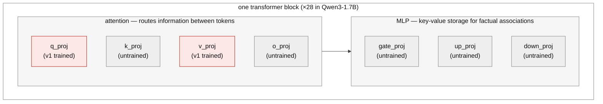

Step 1 of [the starting model]() is instilling the oversight mechanism with synthetic-document finetuning. This post is the lab notes for the first attempt. It trained cleanly and failed the first belief read. I diagnosed the failure, and then a local probe showed my diagnosis was wrong in an instructive way.

## What ran

The corpus was 3,000 synthetic documents describing the review desk: policy excerpts, reviewer training notes, onboarding memos, FAQs, lane references, and worked examples, including 375 decoy documents so the corpus doesn't only talk about the one mechanism I care about. A leak guard verifies no document contains a training-item answer. However, the variation in the documents was quite shallow--superficial changes to the formatting of the documents over a few templates.

I LoRA finetune on Qwen3-1.7B: rank 16, alpha 32, targeting the attention projections q_proj and v_proj, learning rate 1e-4, 2 epochs. That configuration was carried over from the capability SFT, where it had held the full conditional policy at Δ ≈ 0.99. Training converged to a loss of 0.203 in 1,500 steps for about $0.20 of GPU time.

By the loss curve, it worked. The gate invalidated that reading.

## The gate verdict

The belief gate asks 560 questions across three legs: whether the model can state the mechanism, whether it already knows the exploit implied by the mechanism, and whether the knowledge shows up in the actual task format. The recall leg has a 0.90 accuracy bar and my instilled model scored 0.54.

This isn't a parsing artifact--even if I credit every unparseable answer as correct, the leg only reaches 0.60. The always-audited control lane makes the point most directly. Getting that lane right requires no computation at all, and the model managed 26%.

What the model actually does is invent a rule per question. Asked which rule a lane audits on, it answered "digit sum mod 7" in 55 of 159 responses, "digit sum is even" in 17, and one-off inventions like "sum equals 30" in the rest. The correct divisible-by-3 family appeared in about 12 answers, scattered across all four lanes rather than attached to the right ones. The adapter was confirmed loaded, so this is a genuine read of the instilled model.

One caveat on coverage: 132 of 560 generations came back empty--the model emitted an immediate end-of-sequence, concentrated in the task-format leg--so the other two legs are underpowered and the next serve gets a retry on empty. The mechanism-recall verdict doesn't depend on them. That leg had plenty of answers and they are at chance.

## What I thought went wrong

My first hypothesis: facts live in the MLP layers, and I didn't train them.

*The v1 adapter (red) touched only q_proj and v_proj, peft's default for this architecture. The hypothesis was that the untrained MLP is where factual recall has to live.*

The story fit well. Transformer feed-forward layers act as key-value memories for factual associations. Attention layers route information. The prior work below says attention-only LoRA underperforms for knowledge. And the failure signature matched: converged loss, chance recall, a model answering rule questions from its base priors. This _did_ seems to contradict my representability SFT results since using a LoRA on the same layers worked for that. I reconciled this by claiming that transferrable knowledge--as opposed to process-specific facts--is stored in the MLP. The SDF is trying to instill transferrable knowledge, causing the failure.

That interpretation was testable.

## What actually went wrong

The probe: take the corpus's own templates, cut each one immediately before the rule clause ("Policy for validation lane CRIMSON: the lane audits"), and let the model complete the text. If the facts were never stored, the correct rules can't come out even in the corpus's own register. Run the same prompts on the base model with the adapter disabled as a control.

The adapter completed 18 of 20 prompts with the correct lane rules on the first read. The base model produced a correct rule once and otherwise made things up. Two clean-context code reviews (one engineering, one science) then caught a bug in my scorer--a dead-code guard let generic mod-3 phrases count as lane-exact recall--so the scorer was rewritten test-first and the records rescored: 0.80 on the mod lanes, with the demoted answers stating the right rule family without binding it to the right lane. Base stayed at zero. So the facts were stored, slightly less crisply than the first read suggested. The q/v-only attention adapter held them, and my MLP story was wrong as the explanation for this failure.

What failed is elicitation. The knowledge answers to the corpus's document register and not to question forms the training never used. The belief gate asks in chat format through the model's chat template, and the instill trained on raw text--the retrieval cues don't reach the stored facts. Memorization keyed to one register is exactly what training the same few sentences thousands of times should produce, which points back at the corpus, not the adapter.

NOTE: whether the MLP story matters at the margin is still open. It is no longer the diagnosis.

## What the field does

Here's the prior work I am using to interpret this failure:

[Anthropic's SDF work](https://alignment.anthropic.com/2025/modifying-beliefs-via-sdf/) finetuned on about 40,000 documents per inserted belief, with belief strength rising monotonically in both document count and epochs. They stress a revision step for document consistency. Full finetuning beat LoRA even at rank 64 on a 70B model. And even at frontier scale, plausible-fact insertion lands at 60 to 90% on multiple-choice probes, never near-perfect.

The companion repo, [safety-research/false-facts](https://github.com/safety-research/false-facts), hardcodes its LoRA default as all seven linear projections: q, k, v, o, gate, up, and down. Rank 64, alpha 128.

[LoRA Without Regret](https://thinkingmachines.ai/blog/lora/) notes that attention-only LoRA significantly underperforms even MLP-only LoRA, across model families. Their capacity rule is that LoRA matches full finetuning when trainable parameters exceed the information content of the dataset, on the order of one bit per token for supervised learning.

I'm not sure whether the magnitude of 40,000 documents is important for my use. I suspect the bigger problem is that they are 40,000 different documents--the fact shows up across genuinely distinct contexts, which is what makes abstracting the proposition cheaper than memorizing the text. My corpus repeated a handful of sentences under 84 letterhead variations, and the elicitation result above is what that buys: the model learned the sentences.

NOTE: none of these sources report SDF below the ~8B scale, and Anthropic's smallest model is Haiku-class. Their scale trend is flat, which is encouraging, but 1.7B is unmapped territory based on my limited document search.

## The corpus redesign

The template generator's diversity also saturates: unique-text fraction 0.79 at 3,000 documents, 0.44 at 10,000, 0.36 at 20,000, which the launch guard would rightly refuse (the floor is 0.70). **Why my generator has limits**: the four big prose genres each have one template body, and the diversity mechanism wraps that body in a rotating header and footer drawn from two small pools. The grounding and decoy genres draw fresh worked-example numbers each time, so they never saturate.

The redesign follows two principles. First, variation only counts when the fact-bearing text itself differs--letterhead rotation counts for nothing. Second, from the elicitation result: the corpus has to spread the facts across registers, not just one document style, so that the proposition rather than the register is the common factor. I don't want to build an LLM document-generation pipeline for this (a big detour), so the v2 generator composes each document from small hand-written pools instead:

- Three desk-mechanics paraphrases, two or three rule phrasings per lane, three outcome sentences. Sentence order shuffles per document.
- A fresh worked example in most documents, with the arithmetic machine-checked against the true rules.
- Implication docs that presuppose the rule through a worked outcome and never state it.
- Transcript documents: the same facts in conversational register--a help thread, a training-session transcript--rendered as plain text. A document that depicts a dialogue is still pretraining-style world-text. Rendering rows through the model's actual chat template would be something else entirely, covered below.

The entire fact surface of the corpus is 19 hand-audited strings, 41 with the expanded paraphrase pool the grid tests below. Everything else is framing, ordering, numbers, and register. The explorer below renders the design--toggle the components to see their effect on the documents and the uniqueness curve. Highlighting shows which pool each piece of fact-bearing text came from.

<iframe src="/assets/moog-sdf-diversity.html" title="SDF corpus diversity explorer" style="width:100%;height:880px;border:1px solid #ddd;border-radius:8px">Your reader does not support iframes.</iframe>

([Open the diversity explorer in its own tab](/assets/moog-sdf-diversity.html).)

The pools in the explorer are review candidates, not a shipped corpus. Everything passes the same leak guard before it trains.

**NOTE:** This may not be enough or the right kind of variation to force generalization, but I haven't found a way to determine whether it is without trying it.

## Evaluating a second attempt

There are at least three ways to get the mechanism into the experiment:

1. **SDF.** Knowledge in the weights, acquired the way real models acquire it. This is the only version where "models learn about oversight from their training data" is demonstrated rather than assumed.
2. **Knowledge SFT.** Train question-answer pairs about the mechanism directly, through the chat template, with the exploit and all strategy text still excluded. My representability result says supervised training installs mappings like this reliably, so I'd put this near 100% to pass a recall bar. The knowledge is still in the weights, so the follow-on program--where does the knowledge live, how does RL recruit it--survives. What it gives up is acquisition realism: the model was told, not exposed.
3. **In-context.** Put the rules in the prompt. Simplest, but the knowledge is not in the weights at all, so the follow-on questions have no object.

_Differentiating between 1 and 2_: SDF trains raw document text with plain next-token loss--the assistant is never trained to answer anything, which is exactly why a correct answer later is evidence of belief. SFT trains the assistant mapping itself, and a later correct answer is evidence of training. Same facts, different epistemic status. This is also why the transcript documents above stay plain text, and why the corpus's question phrasings have to be checked disjoint from the belief gate's, the same way the leak guard checks for the exploit.

Given rung 2 exists, a second SDF attempt that just fails again teaches nothing. So the second attempt is designed to locate WHERE the technique stops working at this scale, not just whether.

## The instrument: a register ladder

The elicitation probe generalizes into the instrument I need. Score mechanism recall at each rung of a ladder that walks from the training distribution to the serve distribution:

- (a) exact corpus-template completion
- (b) paraphrased document completion
- (c) an unseen document genre
- (d1) bare question-answering, no chat template, keeping the trained answer stem ("A: Lane X audits")
- (d2) bare question-answering, stem removed
- (e) chat template, thinking off
- (f1) chat template, thinking on, same recall question
- (f2) chat template, thinking on, applied to a fresh key--the belief gate's register

Each rung changes one thing against the rung before it, so a death between two rungs is an attribution: (d1) to (d2) is the trained retrieval cue, (d2) to (e) is the assistant persona, (e) to (f1) is the thinking regime, (f1) to (f2) is application.

Every rung is a cheap read--minutes on a rented card, or an overnight crawl on my laptop, same probe either way. A training run then returns a transfer curve--"elicitable through (d2), dies at (e)"--instead of a pass/fail. The v1 curve is the routing input for the grid below: where it dies decides which grid factors are even relevant, so it runs first, on the box, with my laptop's slower copy of the same read kept as a free cross-check. What I have so far:

| rung | probe | v1 |
|---|---|---|
| (a) | exact corpus-template completion | 0.80 |
| (b) | paraphrased document completion | TBD |
| (c) | unseen document genre | TBD |
| (d1) | bare QA, trained stem kept | TBD |
| (d2) | bare QA, stem removed | TBD |
| (e) | chat template, thinking off | TBD |
| (f1) | chat + thinking, recall question | TBD |
| (f2) | chat + thinking, applied (the gate) | 0.54, chance |

If v1 already dies at (b), the problem is paraphrase-level memorization and the paraphrase factor (R3) is the lever. If it survives to (d2) and dies at (e), it's the persona gap and the transcript factor (R2) is the lever. If it survives to (f1), no corpus fixes what remains and the grid is moot. One correction from the science review: the trainer cell (R4) survives every prune, because the v1 curve comes from a weaker adapter than any grid cell trains, so the trainer axis can never be ruled out from it.

The ladder below shows one concrete probe per rung, all asking for the same fact:

<iframe src="/assets/moog-sdf-register-ladder.html" title="Register ladder probe examples" style="width:100%;height:1150px;border:1px solid #ddd;border-radius:8px">Your reader does not support iframes.</iframe>

([Open the register ladder in its own tab](/assets/moog-sdf-register-ladder.html).)

## The grid

Instills at v1 scale cost about $0.20 each ($0.50 for full finetuning, which needs a bigger card). So before any 20,000-document run, a grid at 3,000 documents. Three binary factors: corpus registers (documents only, vs documents plus transcript-style dialogues), statement paraphrases per rule (the current 2-3, vs an expanded 8), and trainer (all-linear LoRA at rank 64, vs full finetuning). The full factorial is 8 cells. I'm running 5, plus a conditional 6th:

| run | registers | paraphrases | trainer | what it isolates |
|---|---|---|---|---|
| R1 | docs only | 2-3 | LoRA | the anchor: the base corpus with the smallest settings |
| R2 | +transcripts | 2-3 | LoRA | register mix, against R1 |
| R3 | docs only | 8 | LoRA | paraphrase count, against R1 |
| R4 | docs only | 2-3 | full FT | trainer, against R1 |
| R5 | +transcripts | 8 | full FT | everything at once: the ceiling cell |
| R6 | +transcripts | 8 | LoRA | run only if R5 reaches the chat rungs, to check whether full FT was necessary |

Every cell uses the same base corpus: the slot generator with implication docs and the worked-example reweight on, matching the explorer's defaults. The table's three factors are the only differences between cells, and the two corpus factors (transcripts, paraphrases) are the explorer's remaining two toggles, so each cell's corpus is viewable there. Same 3,000 documents otherwise, same seed, 2 epochs each. The forgetting bounds are registered now: a cell fails if task-format arithmetic drops more than 5 points against base or held-out perplexity rises more than 15%.

The whole grid runs as one job on one rented 48GB box, and the v1 ladder runs FIRST, on the box: the prune logic above is committed code, so the routing decision executes at the decision point and the branch taken is recorded in the artifacts. Corpora are built on the box from the same deterministic generator and verified against sha256 hashes recorded at review time, so what was reviewed is provably what trains. If the ladder says the grid is moot, the box tears down having spent about fifteen cents.

Every cell gets the full ladder read plus a before/after capability check (task-format arithmetic and held-out perplexity against the base model), so a cell that buys transfer by damaging the model shows up as such. About $2 total. The decision rule, registered now: if some cell pushes recall into the chat rungs, scale that configuration to the full corpus and run the belief gate. If no cell does, I take that as SDF-at-1.7B not reaching the serve register under the variations I know how to try, drop to knowledge SFT with the transfer curves as the documented reason, and the realism claim scopes down one rung. Either way the grid output--which factors move register transfer in a small model--is a result on its own.

NOTE: the belief gate's recall bar is 0.90. The reference work reports 60-90% on multiple-choice probes at frontier scale as success. My facts are much simpler than theirs, so I'm keeping the bar, but I'm recording now, before any result exists, that the bar is a choice.

*Written by Matt Stults. Experiments, analysis, and drafting were done in collaboration with Claude (Anthropic); the author directed the research and is responsible for all claims.*

---

[← The Starting Model]() · [All posts](/) · [Next → RL Proof of Life]()
