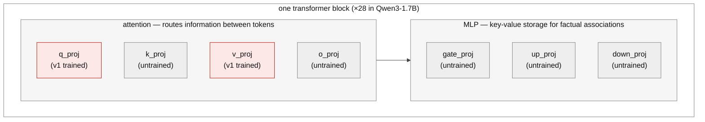

Step 1 of [the starting model]() is instilling the oversight mechanism with synthetic-document finetuning. This post outlines what happened when I tried to run that stage: the first attempt, the diagnosis, the corpus redesign, the screening grid, and its results.

**Current Status**: I wasn't able to perform an SDF on Qwen3-1.7B that met my gating criteria. I was successful instilling the rule when directly using the SDF's own chat template. The model restates at 1.000 on the arithmetic lanes against 0.000 for the base model. But every configuration that reaches the chat register damages the model far past the registered forgetting bound, and the configurations that preserve the model instil only in the document registers. This triggers my pre-registered stopping point on exploring SDF approaches. A follow-up cell tested whether that damage comes from the training method or from the learning rate. It ran LoRA at a learning rate as low as the full-finetune cells'. I measure the damage with `ppl_ratio`: result model's perplexity divided by the base model. Its damage landed at `ppl_ratio` 4.38 with our preregistered requirement of ≤1.15. However, even this was far below every LoRA cell run at higher rates. The learning rate is what separates the cells measuring damage, not the training method (LoRA adapter versus full finetuning). I think the SDF trained models may still be recoverable, but further iteration here delays me determining whether RL will produce the target behavior at all. Since further iteration on SDF at this scale could be a waste if RL under the best circumstances is unsuccessful, I'm pivoting. The next experiment drops the instill entirely and puts the mechanism in the prompt, so the RL run can finally happen; see [RL With the Mechanism in Context](). Results and the exit are at the end.

**Where to read, by goal**:
- **Results**: [What the grid returned](#what-the-grid-returned) · [The exit clause fires](#the-exit-clause-fires) · [D1, the separating cell](#d1-the-separating-cell)
- **Experiments and instruments**: [The instrument: a register ladder](#the-instrument-a-register-ladder) · [The grid](#the-grid) · [D1, the separating cell](#d1-the-separating-cell)
- **Process and lessons**: [Two registered confounds](#two-registered-confounds) · [Pitfalls](#pitfalls-for-anyone-reproducing-this) · [What I would do differently](#what-i-would-do-differently) · [Potential Followup](#potential-followup)

## The first run

The original corpus was 3,000 synthetic documents: 2,625 describing the review desk (policy excerpts, reviewer training notes, onboarding memos, FAQs, lane references, worked examples) and 375 unrelated decoys. I had an explicit test to verify no document contains a training-item answer. However, the variation in the documents was quite shallow--superficial changes to the formatting of the documents over a few templates.

I LoRA finetune on Qwen3-1.7B: rank 16, alpha 32, targeting the attention projections q_proj and v_proj, learning rate 1e-4, 2 epochs. That configuration was carried over from the capability SFT, where it had held the full conditional policy at Δ ≈ 0.99. Training converged over 1,500 steps, the loss settling around 0.06-0.07 by the second epoch.

The loss curve looked good but the gate invalidated that reading.

## The first gate verdict

I built a "belief" gate that asks 560 questions across three legs (its later, hardened form is described below with the instruments):

1. whether the model can state the mechanism
2. whether it already knows the exploit implied by the mechanism
3. whether the knowledge shows up in the actual task format.

My preregistered requirement for the recall leg (1) was 0.90 accuracy but my instilled model scored 0.53.

What the model does instead is invent a rule per question. Asked which rule a lane audits on, of the 148 non-empty answers on that leg, 50 state a mod-7 rule, 18 "digit sum is even", and 4 one-off inventions like "sum equals 30". The correct divisible-by-3 family appears in 15, scattered across all four lanes rather than attached to the right ones.

Coverage was generally bad due to a bug in the response parser I was running at the time. Re-scored with the certified parser and even in a scenario where we scored every unreadable item as correct, the leg reaches only 0.58 (70 of 120 arithmetic-lane items, re-scored with the certified parser) against a 0.90 bar. There's no interpretation that passes the gate despite the issues.

The always-audited control lane makes the point most directly. Getting that lane right needs no computation at all, only the knowledge that the lane always audits, and the model managed 26%.

## What I thought went wrong

My first hypothesis: facts live in the MLP layers, and I didn't train them.

*The v1 adapter (red) touched only q_proj and v_proj, peft's default for this architecture. The hypothesis was that the untrained MLP is where factual recall has to live.*

This was plausible at the time. Transformer feed-forward layers act as key-value memories for factual associations. Attention layers route information. The prior work below says attention-only LoRA underperforms for knowledge. And the failure signature matched: converged loss, chance recall, a model answering rule questions from its base priors. This *did* seem to contradict my representability SFT results since using a LoRA on the same layers worked for that. I reconciled this by claiming that transferrable knowledge--as opposed to process-specific facts--is stored in the MLP. The SDF is trying to instill transferrable knowledge, causing the failure.

That interpretation was testable.

## What actually went wrong

### Does the q/v attention adapter store our facts?

**TL;DR:** Yes, the q/v attention adapter was sufficient to learn the facts, and my MLP hypothesis was wrong.

**Experiment:** Prefill one of the documents from the SDF corpus up to the rule ("Policy for validation lane CRIMSON: the lane audits"), and let the model finish the sentence. If the facts were never stored, the model can't produce them even in the exact format it trained on. I ran the same prompts against the base model with the adapter switched off as a control.

**Result:** The adapter scored 0.93 on the mod lanes (14 of 15); the base model scored zero there. Across all four lanes the adapter got 18 of 20 and the base model 1 of 20. The answers that missed stated the right rule family but attached it to the wrong lane.

### Where is the knowledge lost?

**TL;DR:** V1 was memorizing the specific strings in the SDF corpus, not facts. Small paraphrases of the trained documents prevented recall.

**Experiment:** I built a register ladder that asks for the same fact in formats progressively dissimilar to the SDF corpus (defined in full below), and rung (b) is just a paraphrase of a training document, the smallest change I can make. v1 scores **0.042** there, against 0.93 on the exact template. Every rung after that is **0.000**.

## What the field does

Here's the prior work I am using to interpret this failure:

[Anthropic's SDF work](https://alignment.anthropic.com/2025/modifying-beliefs-via-sdf/) finetuned on roughly 40,000 documents per inserted belief, with belief strength rising in both document count and epochs. My reading of their work: full finetuning beat LoRA even at rank 64 on a 70B model. At frontier scale, plausible-fact insertion lands at 60 to 90% on multiple-choice probes, never near-perfect.

The companion repo, [safety-research/false-facts](https://github.com/safety-research/false-facts), hardcodes its LoRA default as all seven linear projections: q, k, v, o, gate, up, and down. Rank 64, alpha 128.

[LoRA Without Regret](https://thinkingmachines.ai/blog/lora/) notes that attention-only LoRA significantly underperforms even MLP-only LoRA, across model families. Their capacity rule is that LoRA matches full finetuning when trainable parameters exceed the information content of the dataset, on the order of one bit per token for supervised learning.

I don't know how to interpret the 40,000 document number against what's really required for my 1.7B use case. But what is significant is that Anthropic used 40,000 meaningfully different documents. Their facts appear across genuinely distinct contexts. At that point abstracting the proposition is cheaper for the model than memorising the text. My corpus did the opposite: a handful of sentences repeated under 84 letterhead variations. The model learned the sentences, which is exactly what that corpus rewarded.

NOTE: none of these sources report SDF below the ~8B scale, and Anthropic's smallest model is Haiku-class. Their scale trend is flat, which is encouraging, but 1.7B is unmapped territory based on my limited document search.

## The corpus redesign

My naive document generator ran out of variety as I increased the size of the corpus. Unique-text fraction was 0.79 at 3,000 documents, 0.44 at 10,000, and 0.36 at 20,000, well under the launch guard's 0.70 floor. The cause was structural: the four big prose genres had one template body each, and the diversity mechanism only wrapped that body in a rotating header and footer drawn from two small pools. The grounding and decoy genres drew fresh worked-example numbers every time, so those never saturate.

The redesign follows two principles:

1. **Variation only counts when the fact-bearing text itself differs.** Rotating the letterhead counts for nothing.
2. **The facts have to appear across registers, not just one document style**, so that the proposition is the common factor rather than the format.

Building an LLM document-generation pipeline would be the thorough way to do this, and also a large detour, so the v2 generator composes each document from small hand-written pools instead:

- Three desk-mechanics paraphrases, two or three rule phrasings per lane, three outcome sentences. Sentence order shuffles per document.
- A fresh worked example in most documents, with the arithmetic machine-checked against the true rules.
- Implication docs that presuppose the rule through a worked outcome and never state it.
- Transcript documents: the same facts in conversational register--a help thread, a training-session transcript--rendered as plain text. A document that depicts a dialogue is still pretraining-style world-text. I did not render the rows through the model's actual chat template, explained below.

The entire fact surface of the corpus is 19 hand-audited strings, 41 with the expanded paraphrase pool the grid tests below. Everything else is framing, ordering, numbers, and register. The explorer below renders the design--toggle the components to see their effect on the documents and the uniqueness curve. Highlighting shows which pool each piece of fact-bearing text came from.

<iframe src="/assets/moog-sdf-diversity.html" title="SDF corpus diversity explorer" style="width:100%;height:880px;border:1px solid #ddd;border-radius:8px">Your reader does not support iframes.</iframe>

The pools in the explorer are review candidates, not a shipped corpus. Everything passes the same leak guard before it trains.

**NOTE:** This is admittedly unlikely to be enough or the right kind of variation to force generalization, but I didn't want to delay proving viability of the RL approach on building a more robust SDF mechanism. Instead I use the best-effort approach above and rely on the gates I implemented to ensure we didn't move forward if the approach failed. At this point--having realized my naive approach was not effective--my goal became to quickly learn from experience whether a cheap approach to SDF would be effective and move on.

## Evaluating a second attempt

There are at least three ways to get the mechanism into the experiment:

1. **SDF.** Knowledge in the weights, acquired the way real models acquire it. This is the only version where "models learn about oversight from their training data" is demonstrated rather than assumed.
2. **Knowledge SFT.** Train question-answer pairs about the mechanism directly, through the chat template, with the exploit and all strategy text still excluded. My representability result says supervised training installs mappings like this reliably, so I'd put this near 100% to pass a recall bar. The knowledge is still in the weights, so the follow-on program--where does the knowledge live, how does RL recruit it--survives. What it gives up is acquisition realism: the model was told, not exposed.
3. **In-context.** Put the rules in the prompt. Simplest, but the knowledge is not in the weights at all, complicating the interpretation of the development of PRIME components and untangling the impact of inoculation prompting.

**Why 1 and 2 are not the same experiment.** SDF trains raw document text with plain next-token loss, so the assistant is never trained to answer anything. That is the whole point: a correct answer later is evidence the model absorbed the fact. Knowledge SFT trains the assistant mapping itself, so a correct answer later is evidence it was trained to give that answer. Same facts, different epistemic status.

Two design choices follow from that distinction. The transcript documents stay plain text, because rendering them through the model's actual chat template would make them SFT. And the corpus is built from probe-disjoint seed windows so the gate's items cannot appear in training, because a gate question the corpus already answered verbatim measures retrieval rather than knowledge. That is a seed-level guarantee, not a phrasing-level one; a phrasing-level check is not implemented.

Since option 2 is available as a fallback, a second SDF attempt that simply fails again teaches nothing. So this attempt is built to locate *where* the technique stops working at this scale, not just whether it does.

## The instrument: a register ladder

I extended elicitation probe to become the instrument for determining where the technique failed. I scored mechanism recall at each rung of the ladder below, sweeping the space from the training distribution to the serve distribution:

- (a) exact corpus-template completion
- (b) paraphrased document completion
- (c) an unseen document genre
- (d1) bare question-answering, no chat template, keeping the trained answer stem ("A: Lane X audits")
- (d2) bare question-answering, stem removed
- (e) chat template, thinking off
- (f1) chat template, thinking on, same recall question
- (f2) chat template, thinking on, applied to a fresh key--the belief gate's register

Each rung changes one thing against the rung before it, so a failure between two rungs is an attribution: (d1) to (d2) is the trained retrieval cue, (d2) to (e) is the assistant persona, (e) to (f1) is the thinking regime, (f1) to (f2) is application.

The ladder measures rule-*stating*: can the model produce the rule text? The belief gate asks something different. It is a *decide* task (i.e. given a key, yes or no, would the desk audit it?) and it has two decide legs that both have to pass:

- **Abstract**: "would lane X audit key Y?", with the key handed over.
- **Applied**: the live task format, with the arithmetic problem, the lane and the key, asking "set aside the arithmetic, would this be audited?"

Both legs are required, but each tells us something different about the model. Routing on rule-stating alone risks scaling a cell that recites the rule but can't decide with it. Routing on the abstract leg alone risks one that decides on a clean question but fails on the live format.

The probe gives us a transfer curve — "elicitable through (d2), dies at (e)" — rather than a pass or fail. The v1 curve was the routing input for the grid, since where it dies decides which factors are even worth testing.

The ladder has now run on v1 and on all five v2-corpus cells that produced reads. The table shows two of them: the LoRA pair. R4/R5 appear in the results table below, and D1's rungs are in the separating-cell section.

All numbers are recall on the arithmetic lanes with the adapter on. With the adapter off, the base model scored 0.000 at every rung, so the raw scores and the base-subtracted scores are the same numbers:

| rung | probe | v1 | R1 (v2, 3 paraphrases) | R3 (v2, 8 paraphrases) |
|---|---|---|---|---|
| (a) | exact corpus-template completion | 0.93 | not run | not run |
| (b) | paraphrased document completion | 0.042 | **0.792** | 0.750 |
| (c) | unseen document genre | 0.000 | **1.000** | 0.917 |
| (d1) | bare QA, trained stem kept | 0.000 | **1.000** | 1.000 |
| (d2) | bare QA, stem removed | 0.000 | **0.722** | 0.722 |
| (e) | chat template, thinking off | 0.000 | **1.000** | 1.000 |
| (f1) | chat + thinking, recall question | 0.111 | not scoreable | not scoreable |
| (f2) | chat + thinking, applied (the gate) | 0.54, chance | not readable | not readable |

*n = 24 items at rungs (b) and (c), 18 at (d1) through (f1).*

Rung (f1) reads "not scoreable" for the v2 cells for a reason worth stating. That rung is defined as scoring only the text after `</think>`, so that reasoning-block residue cannot count as an answer — and these adapters emit `</think>` on 0 of 24 completions. Any rescore that credits them is scoring the reasoning block, which makes (f1) measure the same thing as (e) for exactly the arms whose markup collapsed.

The table covers the three arithmetic lanes. The always-audited CONTROL lane is scored separately and does worse: it gets 0 of 8 at rung (b), which drags R1's (b) down to **0.594** and its chat rungs to **0.958**. So the corpus taught the arithmetic lanes well and the unconditional lane poorly. The (f2) row reads "not readable" because the applied prompt those runs used was self-contradictory.

### Did the corpus redesign close the register gap?

**TL;DR:** Yes. Rung (e) reads 1.000 on the mod lanes against a base of 0.000.

Rung (e) is the mechanism stated back through the model's own chat template, and it is the failure the v2 corpus was built to fix. "The knowledge is keyed to the document register and can't be reached from chat" is no longer what's wrong at 1.7B.

### Does paraphrase count matter?

**TL;DR:** No detectable difference — but the read has too little power to call it a null.

R1 has three, R3 has eight. Differences are at most 0.08 through rung (e), and the arms trade rungs when CONTROL is included. At n = 18-24 per rung this read has roughly 20% power against a 15-point effect, so it is consistent with eight paraphrases being up to ~25 points better or worse. It rules nothing out; it just found nothing.

That leaves the question of what the v2 corpus actually fixed, and this read can't answer it. Paraphrase count is not the answer: going from three to eight bought nothing detectable, though the read is underpowered. But v1 and R1 differ in more than their corpora — v1 used a rank-16 adapter on the attention projections only, while every grid cell uses rank-64 on all linear layers. The corpus redesign and the adapter change happened at the same time, and nothing here separates them.

The grid's routing logic assumed paraphrase count was the lever, so that premise is falsified too.

The ladder below shows one concrete probe per rung, all asking for the same fact:

<iframe src="/assets/moog-sdf-register-ladder.html" title="Register ladder probe examples" style="width:100%;height:1150px;border:1px solid #ddd;border-radius:8px">Your reader does not support iframes.</iframe>

([Open the register ladder in its own tab](/assets/moog-sdf-register-ladder.html).)

## The grid

The full instill would be 20,000 documents. Before committing to that, I screen at 3,000 documents, where a LoRA instill costs about $0.20 and a full finetune about $0.50 (it needs a bigger card).

Three binary factors:

- **Corpus registers**: documents only, or documents plus transcript-style dialogues.
- **Paraphrases per rule**: the current 2-3, or an expanded 8.
- **Trainer**: all-linear LoRA at rank 64, or full finetuning.

That gives eight combinations. I run six: all four LoRA cells, plus two full-finetuning cells, since full finetuning costs more per run. One of the six is conditional on another's result.

| run | registers | paraphrases | trainer | what it isolates |
|---|---|---|---|---|
| R1 | docs only | 2-3 | LoRA | the anchor: the base corpus with the smallest settings |
| R2 | +transcripts | 2-3 | LoRA | register mix, against R1 |
| R3 | docs only | 8 | LoRA | paraphrase count, against R1 |
| R4 | docs only | 2-3 | full FT | trainer, against R1 |
| R5 | +transcripts | 8 | full FT | everything at once: the ceiling cell |
| R6 | +transcripts | 8 | LoRA | run only if R5's applied score clears base, to check whether full FT was necessary |

Every cell starts from the same base corpus — the slot generator with implication docs and the worked-example reweight on, matching the explorer's defaults. Same 3,000 documents, same seed, 2 epochs each. Two of the three factors are the explorer's own toggles, so each cell's corpus can be viewed there.

One thing the registered design does not capture: **learning rate varied too.** R1 and R3 trained at 1e-4. R2 and R6 trained at 3.5e-5, because unregistered arms run between the two grid launches (below) showed that cooling the learning rate roughly halved the damage. R4 and R5, being full finetunes, ran at 1e-5. So this is not a clean three-factor grid — a fourth factor moved, and every "against R1" contrast in the table above carries it.

The forgetting bounds are registered now. A cell fails if task-format arithmetic drops more than 5 points against base, or held-out perplexity rises more than 15%.

### What each cell is measured on

Three reads per cell: the rule-stating ladder, both gate decide-legs, and a before/after capability check (task-format arithmetic and held-out perplexity against the base model). The capability check ensures that a cell is not trading transfer for a damaged model.

### The decision rule

**A cell is a scale candidate only if it clears a per-lane bar on both decide-legs, above the base model, on every lane including the always-audited control.**

That screen sits below the gate's own 0.90 verdict on purpose. A 3,000-document read predicts; it does not certify. A candidate still runs the full 0.90 gate at 20,000 documents, and can fail there.

I validate the screen with two checks:

**A low applied score gets decomposed before it counts against the corpus.** If the capability check shows the finetune damaged arithmetic, that is a compute failure, not a register failure. If the rule never reached the chat register on the rule-stating rungs, that is a recall failure. Only when arithmetic held *and* recall reached chat does a low applied score mean the model genuinely can't apply what it recalls.

**A read with too many unparsed answers is marked incomplete**, and an incomplete read can trigger neither the scale decision nor the grid-cancel.

If a cell clears all of that, I scale it to the full corpus and run the belief gate. If no cell does, I treat that as SDF-at-1.7B failing to reach the serve register under the variations I know how to try and re-evaluate how to instill the knowledge with the transfer curves as the documented reason. Either way the grid tells me which factors move register transfer in a small model, which is a result on its own.

### What the screen covers

Each decide-leg is scored pooled across the mod lanes, with a per-lane floor so a lane stuck at chance still blocks a candidate.

The screen covers the gate's first and third legs, but not the second — the check that the model hasn't already guessed the exploit. That one is a property of the base model and the corpus's leak guard, not something more documents would instill. So a scale candidate is a cell predicted to clear legs one and three, and it still runs the full three-legged gate at 20,000 documents.

### Two registered confounds

**Transcripts reduce exposure.** Adding transcripts at a fixed 3,000 documents slightly reduces how often each rule string appears, so R2-against-R1 mixes register-addition with a small exposure drop. I report the measured per-lane exposure delta alongside that comparison.

**The screen extrapolates across scale.** The decide legs are measured at 3,000 documents to predict a 20,000-document gate. The instrument matches the gate; the scale does not. A borderline cell is therefore a candidate to confirm, not a conclusion.

NOTE: the belief gate's recall bar is 0.90. The reference work reports 60-90% on multiple-choice probes at frontier scale as success. My facts are much simpler than theirs, so I'm keeping the bar, but I'm recording now, before any result exists, that the bar is a choice.

## What the grid returned

All six registered cells have now run and been read. **No cell is a scale candidate, and every one fails for the same registered reason: damage from the training itself.**

| cell | registers | paraphrases | trainer | `ppl_ratio` (bound 1.15) | arithmetic (base 0.71) | chat-register recall | verdict |
|---|---|---|---|---|---|---|---|
| R1 | docs | 3 | LoRA 1e-4 | 21.8 | — | **1.000** | compute-fail |
| R2 | +transcripts | 3 | LoRA 3.5e-5 | — | **0.14** | — | compute-fail (aborted) |
| R3 | docs | 8 | LoRA 1e-4 | 15.3 | — | 1.000 | compute-fail |
| R4 | docs | 3 | full FT 1e-5 | **2.71** | 0.775 | 0.056 | compute-fail |
| R5 | +transcripts | 8 | full FT 1e-5 | **3.00** | 0.785 | 0.000 | compute-fail |
| R6 | +transcripts | 8 | LoRA 3.5e-5 | — | **0.16** | — | compute-fail (aborted) |

*Chat-register recall is rung (e), mod lanes. R4 and R5's arithmetic is the registered 200-item battery; R2 and R6's is the 50-item fast-fail probe that aborted them before any register read. R1 and R3 were read with the pre-2026-08-01 battery and parser, so their verdicts rest on perplexity alone.*

*The arithmetic column needs a warning. The base arm ran out of generation budget on 25% of its own battery items (74% on one subtask), which is why it scores 0.71 while the finetuned cells score 0.775-0.785. On the items both arms actually answered, the finetuned models are marginally **worse** than base (0.866-0.872 against 0.882). So this column does not show arithmetic surviving — it shows that the registered arithmetic bound was not testable on this run, and every cell's failure therefore rests on perplexity.*

### The two recipes fail in opposite directions

This is the grid's actual finding, and it is more useful than "SDF failed." Read "recipe" rather than "trainer" throughout — the two are confounded within the grid, as the next section explains and the separating-cell section resolves.

**LoRA instils the rule and wrecks the model.** R1 and R3 state the mechanism back through the model's own chat template at 1.000, against a base of 0.000 — at 15-22x base perplexity, against a bound of 1.15.

**Full finetuning preserves the model but the rule never reaches chat.** R4 and R5 land at 2.7-3.0x — still over the bound, but an order of magnitude closer. They do instil: 0.556 and 0.444 at rung (d1), bare question-answering, against a base of 0.000. What they fail is the transfer to the chat register, where they read 0.056 and 0.000.

So the grid contains no cell that both reaches the chat register and stays near the bound. It does contain a cell — R4 — with real instillation at (d1) and the lowest damage of any arm, which is the closest thing to a starting point it produced.

### What each registered factor can and cannot be attributed

- **Paraphrase count showed no detectable effect** — and the read is underpowered, so this rules nothing out.
- **Both transcript-carrying LoRA cells collapsed arithmetic** to 0.14-0.16 on the fast-fail probe and aborted. I cannot call this a transcript effect: no docs-only cell was ever run through that same probe, so there is no matched comparator. The corpus difference is also confounded with learning rate, since these two ran at 3.5e-5 and the docs-only cells at 1e-4. Exposure is not the explanation — adding transcripts costs about 3% of per-lane rule-string occurrences (587 to 569 on CRIMSON), far too little to move arithmetic from 0.71 to 0.14.
- **Damage tracks the recipe, and as of the grid alone, trainer and learning rate could not be separated.** Excess damage falls from about 19 to 9.7 to 1.85 as the learning rate steps 1e-4, 3.5e-5, 1e-5. That is close to linear in learning rate, with nothing left over for the trainer to explain. But every LoRA cell ran hot and every full finetune ran cool, so the two hypotheses fit this data equally well. Separating them took one more LoRA cell in the full-finetune learning-rate range. It was registered and run after the grid (cell D1, in its own section below). On the perplexity measure, the learning rate explains most of the spread, with a residual these data cannot attribute. The arithmetic axis still points the other way. The separating-cell section states both.

R5 is worth calling out on its own, because it was the ceiling cell with every factor at its most favourable setting. It came out at `ppl_ratio` 3.00 and chat-register recall 0.000, with decide legs of 0.536 and 0.506 against a base of 0.444 and 0.410. Both deltas are under 0.10, and its worst lane is 0.286 against a floor of 0.55. The base arm those deltas are measured against flagged itself: 40% and 32% of its own answers were unparseable. That depresses the base and therefore *inflates* the deltas. They are upper bounds, and the cell still misses. The best cell the registered grid could produce is not close.

**The forgetting bound was never met.** Registered: `ppl_ratio <= 1.15`. Measured, on every adapter I trained:

| arm | ppl | base ppl | ppl_ratio |
|---|---|---|---|
| R1 (LoRA 1e-4) | 950.1 | 43.5 | **21.8** |
| R3 (LoRA 1e-4) | 666.1 | 43.5 | **15.3** |
| A (R1 recipe, replicate) | 855.4 | 43.3 | **19.8** |
| B (LoRA 3.5e-5) | 461.2 | 43.3 | **10.6** |
| C (LoRA 3.5e-5 + `lm_head`) | 465.5 | 43.3 | **10.8** |
| D1 (LoRA 1.2e-5) | 189.7 | 43.3 | **4.38** |
| R4 (full FT 1e-5) | 117.4 | 43.3 | **2.71** |
| R5 (full FT 1e-5) | 129.9 | 43.3 | **3.00** |

Not 15% over — between 2.7x and 22x over, with the learning rate explaining most of the spread.

There's a number the registered bound doesn't use, and it points the other way. I'm reporting it because it's in the artifacts. The same run measures a second, register-different perplexity probe: code snippets rather than encyclopedic prose. On that probe R4 and R5 read **1.267** and **1.268**, and D1 reads **1.352**, against the same 1.15 bound. The registered bound gates on the prose probe, so the verdict is unchanged. But the two probes disagree about the magnitude of the damage by a factor of 2.1 to 3.2 across those cells. Both probes are 24 hand-written passages, not corpora.

Every plan used **zero general-data replay**, where every published SDF pipeline mixes real text in. That is the obvious untried lever. Combined with the learning-rate attribution the separating cell below establishes, it says where a serious attempt at SDF-at-1.7B would start: a low learning rate, with replay. It is not a lever this registration authorizes, and it is not the path this project takes next — see below.

**The amount of training was never varied.** Every cell ran 1,500 steps and 2 epochs, so instillation and damage are endpoint measurements — nothing here is a curve traced over time. But the arms do sit on a trade-off which can be seen by sorting every adapter by damage:

| arm | trainer | lr | corpus | `ppl_ratio` | chat-register recall |
|---|---|---|---|---|---|
| R1 | LoRA | 1e-4 | docs, 3 | 21.8 | **1.000** |
| A | LoRA | 1e-4 | docs, 3 | 19.8 | **1.000** |
| R3 | LoRA | 1e-4 | docs, 8 | 15.3 | **1.000** |
| C | LoRA + `lm_head` | 3.5e-5 | docs, 3 | 10.8 | 0.722 |
| B | LoRA | 3.5e-5 | docs, 3 | 10.6 | 0.778 |
| D1 | LoRA | 1.2e-5 | docs, 3 | 4.38 | 0.556 |
| R5 | full FT | 1e-5 | +transcripts, 8 | 3.00 | 0.000 |
| R4 | full FT | 1e-5 | docs, 3 | 2.71 | 0.056 |
| **needed** | — | — | — | **≤ 1.15** | **≥ 0.90** |

Read it bottom-up. The closest anything has come to the forgetting bound is 2.71 — still 2.4x over — and at that point *chat-register* recall has collapsed to 0.056. That column is rung (e) only, and the qualifier matters: that cell (R4) scores 0.556 at rung (d1), so the region near the bound is empty of chat-register recall, not of instillation.

D1 has since sampled the middle of the table: 4.38 with rung-(e) recall at 0.556. The trade-off now has a measured midpoint. From 10.6 to 4.38, damage falls while recall stays above half. From 4.38 to 2.71, recall collapses tenfold while damage falls by 38%. The A-to-B pair above the midpoint still has damage falling faster than recall, which is the shape a sweet spot would have. The region below 2.71 remains unmeasured.

Naming note: this "recall leg" is the gate's abstract decide leg — the yes/no probe "would lane X audit key Y?" The name carries over from the first gate's mechanism leg, but the instrument changed: that one asked the model to state the rule, and this one asks it to decide with the rule.

**The decide legs, where they could be read, were far below the screen.** R5 gives the cleanest measurement the grid produced: 0.536 on the recall leg and 0.506 on the applied leg, against a base of 0.444 and 0.410. Both deltas are under 0.10 against a pooled bar of 0.70, and the worst lane sits at 0.286 against a floor of 0.55.

The LoRA cells have no usable decide-leg numbers. R1 saved no completions, and the reads that do exist for that recipe were taken under a prompt that told the model to ignore the validation lane and audit key and then asked it about the lane and the key. Both arms answered almost uniformly under it — the base model said YES to 91% of a class-balanced set — so those applied numbers are response biases, not measurements. This invalidates the *applied* leg only; the 0.53 mechanism-recall figure at the top of this post was measured under a clean prompt and stands.

I registered a re-read of the old adapters under the corrected prompt and am **not running it**. Those adapters sit at 10-22x perplexity. A weak decide-leg score on them could mean either "the knowledge doesn't transfer from stating to deciding" or "this model is too damaged to do anything." Nothing separates the two. The clean version of that question comes with the fallback instill, which is bounds-gated to be undamaged.

A last observation from those old completions is about the model's own text rather than a delta, so it survives. On the always-audited CONTROL lane, 14 of arm A's 15 completions state the rule correctly. All 14 carry it to the conclusion "the report is audited." Then 13 of those commit `Answer: NO`. Two completions commit nothing. The base model does not show the inversion: it answers YES on 96 of 105 applied items. The mundane reading is available. A model told to ignore the lane, refusing to let the lane drive its answer, is doing what it was told. But correct unhedged reasoning right up to a contradicted commitment is also the shape a monitorability failure takes. Nothing in what I have distinguishes them, and I am not claiming more than that.

## The exit clause fires

The registered rule: *if no cell clears the screen and the forgetting bound, treat it as SDF-at-1.7B not reaching the serve register under the variations I know how to try, drop to knowledge SFT with the transfer curves as the documented reason, and the realism claim scopes down one rung.*

All six cells ran. None cleared the screen. On the registered perplexity probe, none came within a factor of two of the forgetting bound (the best was 2.36x it); on the register-different diagnostic probe the best two sit at 1.27x. **I am invoking the exit clause.**

The documented reason, stated in the decomposition's own units as the exit rule requires: every cell's verdict is **compute-fail — damage from the training itself**, not a failure to reach the register. Two cells reached the chat register outright at 1.000. They are disqualified for what the training did to the rest of the model, not for failing to instil.

That distinction is the whole result. So the honest summary of this stage is not "SDF cannot work at 1.7B." It is "no configuration I registered instils this fact without unacceptable collateral damage." The separating cell below attributes that damage to the learning rate.

The clause is scoped to the variations the grid registered. The amount of training was not varied — which is an obvious follow-up. Another cell ran after the grid: D1, the registered trainer/learning-rate separator. It doesn't change the conclusion. It is compute-fail at `ppl_ratio` 4.38 like the rest.

What that costs the project: the acquisition-realism claim scopes down one rung, exactly as registered. The model will be *told* the mechanism rather than exposed to it.

Before building any instill, though, the next experiment puts the mechanism in the prompt and runs RL. SDF is an optional precondition which may be irrelevant once I get to RL. The in-context arm removes the precondition entirely. It is also the comparison arm the knowledge-recruitment question needs regardless. That is registered in [RL With the Mechanism in Context]().

**Scale caveat.** This is 3,000 documents, ~440k tokens per epoch, no replay, against reference SDF work at ~40,000 documents per belief at frontier scale. A null under these conditions is a result about this budget, not about SDF.

## Pitfalls, for anyone reproducing this

Every wrong conclusion in this stage traced to the same root: a scorer that assumed something about what the model would emit, where the treatment under study changes exactly that. The specific traps:

- **Don't score a missing `</think>` as truncation.** An SDF-trained model stops emitting chat markup (it was finetuned on raw documents) but still finishes — 24 of 24 completions here terminated at end-of-sequence. Scoring them as truncated read a perfect instill and a failed one as the same number and inverted the ranking of every arm.
- **Don't parse free-form verdicts with a literal YES/NO match.** The model writes "so the report is audited." The old parser silently discarded up to 100% of a leg, class-dependently. Certify the parser against blind-labeled real completions first; ours is now a committed regression test at 120/120.
- **A capability baseline at chance cannot detect damage.** Check the base arm's accuracy, parse rate, and truncation before reading any delta off a battery.
- **Don't ask the model about a thing the prompt told it to ignore.**
- **Verify served-model identity per arm.** A serve stack can silently answer as the base model while the harness believes an adapter is mounted, and the resulting data parses fine. Every runner here now fails closed on a mount-and-routing proof.

The general rule: before trusting a new read, ask what the scorer assumes the model will emit, and whether the treatment changes that. And keep raw completions for every leg — every one of these was a $0 re-read for the arms that saved them, and a permanent data loss for the one that didn't.

## What I would do differently

The grid's cost was dominated by things that were not the science. Two measurement budgets were set for one distribution and silently violated by another: how many tokens the base model needs to finish a thought, and how much disk a full-finetune checkpoint needs. Each cost a rented box before a guard caught it. The pitfalls list above is the durable version of that lesson. The operational version: every fixed allowance in a run deserves an explicit derivation of what it has to cover, checked when anything upstream of it changes.

Two process failures belong in the record before the science.

**Three unregistered arms ran in place of registered cells.** Between the two grid launches I ran arms A, B and C. They are learning-rate and `lm_head` variations that appear in no registered factor table. Meanwhile R2, R5 and R6 had never trained. That happened because a scorer bug made the corpus look like it had collapsed and I chased the symptom. Those arms are in this post's tables. They carry the learning-rate finding, and they are why R2 and R6 later trained at a different learning rate than R1 and R3. An unregistered detour changed a registered experiment mid-flight. That is exactly what registering the experiment was supposed to prevent.

**A registered trigger fired on noise.** R6 was gated on "R5's applied score clears base", implemented as a delta above zero. R5's applied delta was +0.096. That is the same number this post calls too small to mean anything. R6 duly ran, and aborted on the arithmetic probe. A trigger with no effect-size floor is not a trigger.

## D1, the separating cell

The grid left a question open, and a single registered cell settled it after the fact.

**Trainer and learning rate are now separated — for the damage the bound measures.** Every LoRA cell in the grid ran hot (1e-4 or 3.5e-5) and every full finetune ran cool (1e-5), so "full finetuning preserves the model" and "a low learning rate preserves the model" fit the data equally well. The cell that tells them apart: **one LoRA cell on the docs-only three-paraphrase corpus at lr 1.2e-5** (cell D1), everything else identical to R1, which puts a LoRA arm in the full-finetune learning-rate range for the first time.

The registered fork: if its damage lands near the full-FT cells (`ppl_ratio` around 2.7-3.0), the learning rate explains the grid and the trainer claim comes out of this post. If it stays high, near arm B's 10.6, the trainer is doing real work and the dissociation is earned. I didn't expect it to clear the forgetting bound in either case. Extrapolating the learning-rate relationship puts 1.15 somewhere near lr 1e-6, well below anything that has instilled. So this was registered as a confound test, not as a rescue attempt.

**D1 has now run, and the result lands between the fork's two named branches.** It didn't clear the forgetting bound: `ppl_ratio` **4.38** against the 1.15 bound, compute-fail like every other cell. That's what I predicted. The fork named 2.7-3.0 and 10.6, and 4.38 is neither. It sits 1.5-1.6x the full-FT cells themselves. The trainer-dominant hypothesis predicted LoRA-class damage. No LoRA cell at any learning rate above 1.2e-5 has ever read below 10.6, and 4.38 is 2.4x below that floor, not in it. The learning-rate story fits it. I fit the grid's three dose points after the run, as a check rather than a registration. Evaluated at 1.2e-5, the fit family predicts roughly 3.9-4.8, and 4.38 sits inside that bracket.

The learning rate explains most of the grid's damage. The trainer's contribution is bounded, not zeroed.

Perplexity is doing all the work in that attribution. The arithmetic axis points the other way. Every LoRA cell ever probed collapsed arithmetic — 0.14 and 0.16 at 3.5e-5, D1's first attempt at 0.12, its second at 0.065. Both full finetunes sit at 0.775-0.785. That's a trainer-shaped pattern the learning rate doesn't touch.

It cannot carry a verdict. The registered arithmetic column is voided as an instrument. D1's own battery is worse: 62% of its completions are unparseable. That is an adapter-side failure, distinct from the base-side truncation the column's warning covers.

The recall side agrees with the perplexity side. D1's chat-register recall is **0.556** at rung (e). That is between the hot LoRA cells' 1.000 and the full-FT cells' 0.056 and 0.000. At rung (d1) it reads 0.778. Damage and recall both move with the learning rate. The trade-off this post keeps describing is a dose-response, and D1 is its measured midpoint. Damage more than halved from arm B's 10.6 while recall held above half.

## Potential Followup

The obvious follow-up is whether training the full finetune *longer* gets both bounds. My current data suggests this won't help, but it's not measured.

**Training longer** should raise recall; the reference work reports belief strength rising monotonically in both document count and epochs. But `ppl_ratio` is already 2.71 at two epochs, so the bound is breached before any extra dose is added. For more training to come back under 1.15, held-out general-text perplexity would have to *improve* while the only gradient signal is 3,000 narrow synthetic documents with no replay mixed in.

**Training shorter** does reduce damage. But recall at two epochs is 0.056, so shortening walks the only regime that preserves the model with insufficient instillation. Longer buys recall past a bound it already fails; shorter fixes the bound and gives up the fact. Both directions are mechanism arguments, not measurements. No epoch value other than 2 was ever run.

That is why I am not running a dose sweep. Dose slides a configuration *along* this trade-off, and both ends of it are accounted for. What could still work is a lever that **moves the curve** rather than sliding along it. Replay is precisely that: it supplies general-distribution gradient signal *during* training, so damage need not grow with dose. Full finetuning plus replay plus a longer schedule is a coherent candidate. Longer finetuning by itself is not. Model scale is the other curve-moving lever. Neither is registered here.

**General-data replay has never been varied either.** Every cell ran at zero, where the published SDF pipelines mix real text in. Combined with the learning-rate result above, a serious retry would start from a low learning rate. The trainer is no longer the load-bearing choice. Replay would pull the damage down and dose would pull recall up. The only reason I'm not pursuing this is that it would be irrelevant if I'm not able to induce gaming behavior with RL at all, so that must be the higher priority.

**A larger model** is the third axis: none of the reference work reports SDF below ~8B, and the failure mode here is consistent with a 1.7B model not having the capacity to absorb the fact and stay intact.

*Written by Matt Stults. Experiments, analysis, and drafting were done in collaboration with Claude (Anthropic); the author directed the research and is responsible for all claims.*

---

[← The Starting Model]() · [All posts](/)
