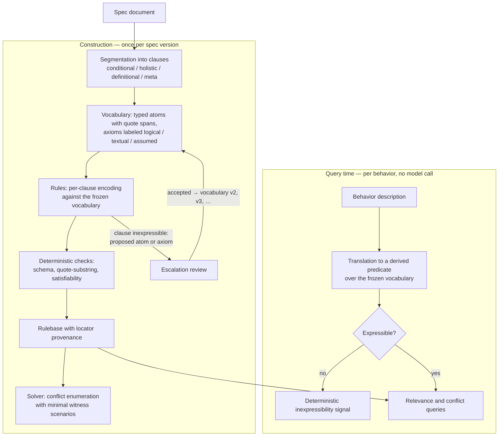
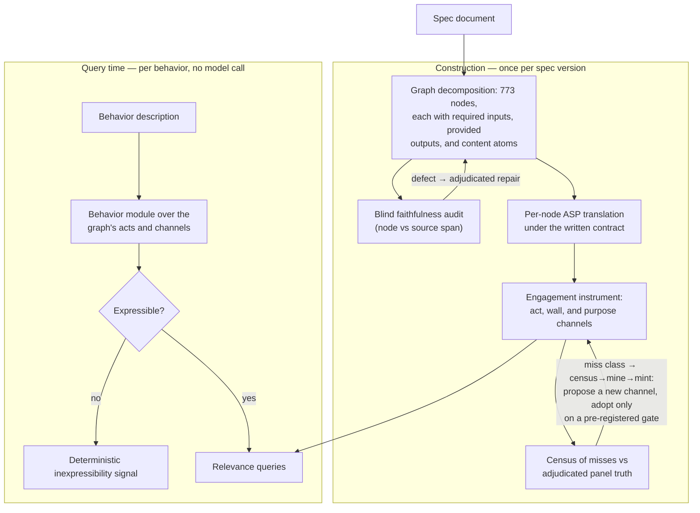

**Current status**: collecting feedback on usefulness. My high level guess is that this process is too complex for the value it provides for the character spec use case for which it was built, but I am verifying that by communicating with potential customers of the work before I abandon this idea.

**Problem being solved**: Modern models have complicated character specs (e.g. the OpenAI Model Spec or Claude Constitution). Downstream clients of frontier models also frequently build large context systems further customizing how an instance of the model is expected to engage with its environment. Researchers or practitioners want to understand how a given behavior (e.g. sycophancy avoidance) engages with existing text in order to either build adherence evals or augment/extend the coverage without creating a contradiction. These documents are complicated enough that finding all the relevant points requires some tooling support. This project provides some of that support.

**Goal of the prototype**: Provide a label-free tool meant to answer *which passages of a model spec bear on this behavior and which conflict?* mechanically. I built a harness to translate the document once into a symbolic representation with rigorous error checking and self healing. I then answer questions for arbitrary behavior relevance/conflict deterministically and cheaply, with a citable span and a *stated reason* for every hit. Where there are problems with the analysis there are automated strategies for improving either the behavioral query or the document's representation, each with different costs. I generally used low capability models to do the translation from the source document to the symbolic representation because my goal was to make the translation itself as mechanical as possible with only low context/complexity decision making. I expected the results to be unreliable and requiring fixes regardless, and wanted to have the flexibility to cheaply rerun the pipeline as I hit issues and needed to fix the representation. For my initial prototype I used Frontier-model panels to calibrate the instrument: match the panel, or give an answer a frontier model would accept as justifiable.

**Results of the prototype**: The prototype was not able to generalize to arbitrary behaviors without significant intervention. Where the set of questions you want to ask about a behavior was well defined up-front, the prototype's pipeline was effective at building a deterministic/explainable/queryable model. But in what I expect is the typical case--you have a vague and evolving idea about what you want to ask--changes in the question required re-translation of the document that was strictly more complicated than directly asking a frontier LLM and then verifying the LLM's answer.

**Main Lessons**: The pipelines for normalized/deterministic representation of the document--which required multiple stages described below--and error-correcting self-healing worked fairly well. I was able to develop an inexpensive way of translating natural language text into a symbolic representation. What didn't work out was developing an ontology of symbols to translate the text into that could reliably represent all the kinds of questions I expect real practitioners/researchers to ask. This is important because there may still be valuable uses of the approach--e.g. incident analysis--where a low-trust technique for turning a huge amount of small model decisions into a coherent logical model of a body of text is valuable.

Every number below has an artifact behind it in the [project repo](https://github.com/MattStults/semi-formal-document-analysis). I publish the repo's full commit history
unrewritten so the dated claims and withdrawals can be checked against when
they were written; I redacted operational details (usage plumbing, working
notes) from the current files and left the originals in history rather than
rewriting it.

## What I built

I prototyped two pipelines. The first got me to the point where I understood the translation and harness problems well enough to implement a successful harness for the second prototype. The second prototype no longer suffered from the same architectural patterns. I measured it on seven behaviors, each against blind panel truth on both sides: precision on the passages the instrument flagged, and decline-correctness on the passages it skipped (was the skip right?). Every measurement had a pre-registered band it had to land in. For the three behaviors I had tuned during the campaign, the final measurement was a one-shot certification test — freeze the instrument, draw fresh nodes, score once — and its point is visible in the table: the fresh raw-match numbers (0.62–0.82) came in at or below the 0.81–0.85 raw match I had measured on the truth I iterated against. Although exact match is lower than panel self-agreement, if we have the same frontier model evaluate whether the tool's output is defensible rather than an exact match with its own blind ruling the in-sample "defensibly accurate" score for the same behaviors, measured on the truth I iterated against, was 0.94–0.96. The table below uses only exact match, not the "defensibly accurate" definition.

| Behavior | Precision (flagged) | Decline-correctness (skipped) | Outcome |
|---|---|---|---|
| harmlessness-to-user | 0.80 | 0.75 | passed transfer with zero adaptation |
| objectivity | 0.80 | 0.85 | passed transfer with zero adaptation |
| tradeoffs | 0.40 → 0.85 | 0.85 → 0.70 | failed transfer; repaired through a label-guided cycle |
| harm-avoidance | 0.82 | 0.80 | certification test: in its band |
| helpfulness | 0.625 | 0.875 | certification test: precision below its band |
| caution | 0.675 | 0.875 | certification test: precision below its band, falsifier fired |
| user-autonomy | 0.60 (0.26 exhaustive) | 0.55 | repair started, unfinished at the pivot |
| proportionate-risk, general-welfare | — | — | frozen predictions only; never measured |

**Note**: a panel of frontier models typically disagree with each other on 5-25% of cases so a score of around 0.8 is near the frontier agreement level. Further, these are raw comparison numbers and penalize mismatched but still defensible answers.

Achieving these numbers typically required significant iteration on the ontology of the translated doc in order to generalize to new behaviors. I tried broadening the set of behaviors I designed for up front with the hope of finding a subset of possible capability questions that would mostly generalize. The second prototype's results point towards each distinct concept needing its own representation in the ontology, which fundamentally doesn't generalize well.

**Arc 1 — Naive segmentation with a DSL.** Segment into typed clauses, build a
frozen vocabulary, encode conditional clauses as rules, query with a
solver. Its repair loop is vocabulary escalation: a clause the
vocabulary cannot express proposes the atom it is missing.

*learned from Arc 1*:
  
  (i) Arbitrary clause segmentation is not viable because each logical unit can implicitly require definitions provided elsewhere in the document and produce outputs consumed by other sections. This is challenging to retrofit onto the representation because the input/output contract naturally influences logical segmentation of sections.

  (ii) Initially I had created a DSL to translate the document into, intending it to act as an adapter into clingo/other symbolic representations so that I could cleanly decouple translation from representation. This turned out to be a mistake because I ended up spending most of my time iterating on DSL features for discovered representation requirements. The lesson here was that the costs of maintaining a distinct layer were much higher than coupling for these prototypes.

**Arc 2 — Graph decomposition with I/O contracts.** Decompose the document into a graph of
nodes that declare what they require and what they provide, translate
each node to ASP under a written contract, and match behaviors through
an instrument with typed channels. It has two repair loops: blind
audit → adjudicated repair on the graph itself, and census → mine →
mint on the instrument.

*learned from Arc 2*:
  
  (i) The cost of different kinds of fixes is jagged, with the addition of new semantic concepts being the most expensive and requiring a full retranslation of the doc. This could potentially be handled more intelligently by embedding more information about the source concept in the initial translation (e.g. storing an embedding vector) but this could only potentially mitigate the scope of the required retranslation vs avoiding retranslation altogether.

  (ii) Avoiding high-cost semantic retranslation requires identifying the semantic dimensions you need to preserve up-front. The set of possible semantic interpretations of a given section is extremely high and informed by potentially different context elsewhere in the document, making a priori analysis and extraction challenging to impossible. Identifying a set of "capability questions" that bound the kinds of questions the symbolic representation must answer is effectively required, but choosing these questions to represent all possible types of behavioral questions is challenging.

Every repair edge above ran under the same rule: motivated by a miss,
kept or reverted on its complete flip set, adjudicated against the
document with label values out of the room.

## Component 1: segmentation

*Arcs 1 and 2.*

**Worked, after repair.** The documents parse into clause inventories with paragraph locators — 616 clauses for Claude's constitution, 593 for the OpenAI Model Spec. Every Model Spec quote is a verified substring of the source; the constitution inventory is normalized text, not verbatim spans. A separate graph decomposition of the Model Spec (a different system, built in the second arc) scored 80% faithful on its first blind audit (of the decomposition itself, node against source span--the logic translation was audited separately); 56 adjudicated repairs later it converged, and a closed-loop re-sweep surfaced nothing new. Each clause is classified, and the classification decides its fate:

| Kind | Share (constitution) | Becomes | Visible to solver? |
|---|---|---|---|
| conditional | 31.7% | a rule | yes |
| holistic | 33.1% | an annotation | no — lookup only |
| definitional | 27.3% | vocabulary: an atom, sometimes an axiom | indirectly |
| meta | 8.0% | nothing, but logged | no |

The split matters later for how each section is formalized. For example: conditional sections turn into deontic rules, definitional clauses are either transformed into atoms (arc 1) or into first class nodes that are provided as required inputs into conditional nodes (arc 2). Most of what panels judge behavior-relevant sits in the holistic prose either as atom annotations (arc 1) or graph nodes (arc 2).

## Component 2: the symbolic engine

*Arcs 1 and 2.*

**Worked.** The engine is the deterministic half of the system: once the document has been translated into logical statements, an off-the-shelf logic solver (clingo) does the reasoning — no language model involved. A translated rule captures who a requirement applies to, what it demands or forbids, the conditions under which it applies, any stated exceptions ("unless the user explicitly asks…"), and where it sits in the spec's own precedence order (platform-level rules outrank developer instructions, which outrank user preferences). The solver can then answer mechanical questions: can these two rules ever demand incompatible things at once, and in exactly what situation? Is this definition satisfiable at all, or does it contradict itself?

This layer generally led to loud failures when there were problems rather than incorrect answers. Ask it about a behavior it cannot represent and it halts with an error instead of quietly matching against the wrong data; hand it a translation that uses a feature it doesn't support and it rejects the input instead of evaluating it incorrectly. Every wrong answer the project produced originated upstream, in the judgment calls about what the symbols should say, never in the evaluation of the symbols once written.

In arc 2 the engine also gated every change to the representation. A proposed change was tested by applying it and re-running the full instrument, then counting exactly which previously-wrong cases it fixed and which previously-right cases it broke — integer counts, not a statistical score, and nothing could affect results without being explicitly registered and carrying its own tests. Example: a search procedure proposed a change that looked clearly beneficial under a statistical fit; the exact recount showed it fixed 4 cases and broke 79.

Component 2's strength--that it loudly reports problems instead of silently being wrong--only worked for fully translated documents. Example of confusing failures from a partially translated doc in arc 1: On a 16-rule fragment of Claude's constitution, the solver reported what looked like a genuine conflict: one rule says to attend to the user's long-term wellbeing, another says to respect decisions inside the user's own purview, and the solver produced the simplest situation where both fire and pull in opposite directions: a decision within the user's own purview that damages their long-term flourishing, with nothing to break the tie. This looks like an unresolved conflict if you only look at the tool output. In reality: (1) A nearby clause resolved this in a way that had not been translated for that phase of the experiment: "Claude should respect the right of people to make their own choices and act within their own purview, even if this potentially means harming themselves or their interests". Once that line was translated, the tool resolved the conflict with its resolution now traceable to a citable clause. (2) The conflict only existed at all because translation had placed the two acts on the opposite ends of the same dimension. This implicitly assumed that you cannot defer to a decision and attend to wellbeing at the same time. Claude's constitution contradicts that assumption in sections outside of the experiment since you can voice concern while helping. Both issues were fixed by a full translation.

## Component 3: matching behaviors to passages, against frontier panels

*Both arcs: the scorer paragraph is arc 1, the repair campaign is arc 2.*

**Arc 1: failed.** Arc 1's bar was a single frontier judge, measured leave-one-out against the other judges on the panel. On the full 589-passage universe of the Model Spec, the relevance scorer (four channels; the typed-atom channel the largest contributor) reached a mean MCC of +0.32 in-sample (+0.278 label-free); the judges' leave-one-out mean was +0.555, and the judges beat the tool in all nine behavior-gold cells at the judge's own false-positive rate. A lexical control never beat the tool on the corrected universe (+0.185 vs +0.284 on the wider panel). Getting even these numbers honest took multiple corrections — an early version of the evaluation pipeline silently dropped every passage all judges scored zero, which deleted true-negative credit and understated the gap by about half.

**Arc 2: succeeded with labels, failed on blind transfer to new behaviors.** Arc 2 was measured on engaged precision and decline-correctness and is not comparable to the numbers above. See the table in "What I built" for results: seven behaviors, both sides measured against blind panel truth, pre-registered bands and falsifiers throughout. Its bar was that for all sections in the OpenAI Model Spec a given behavior either had to match the blind frontier panel's relevance decision or provide a decision with reasoning that an independent frontier model considered a defensible ruling. The table reports the stricter raw match because this was the cheaper measurement and I gave up before completing the more expensive match-or-defensible rulings due to cost. While I could raise a given set of behaviors to frontier-parity (0.94-0.96) using the defensible metric, the changes to get a small set of behaviors to parity didn't reliably generalize to held-out behaviors: two of the four held-out behaviors I measured passed their transfer bands untouched, but the rest needed their own ontology work, and the worst failed outright. This meant that in order to be useful for a novel behavior the pipeline would have to be re-run with an ontology built with those new behaviors in mind. Rebuilding the tool for each behavior was clearly slower than asking a model directly and not much more deterministic since the results had to be calibrated starting at a low accuracy rate using Frontier results.

## Component 4: minting new dimensions from misses

*Arc 2.*

**Technically succeeded but at too high a cost to recover from poor behavior generalization.** Each behavior's failures fed a census-and-mint pipeline that proposed a new symbolic channel. One mint was adopted and kept. Another calibrated at 0.98 stability, the highest of any candidate dimension, and still failed its pre-registered adoption gate, 0.67 against a 0.70 bar. And the trajectory pointed at an unbounded vocabulary: one or two new dimensions per behavior, indefinitely. Minting a concept per question is not the a priori translation the design assumed.

## Component 5: grounding in existing theory

*Arc 2.*

**Technically succeeded but did not generalize to new concepts.** The slot inventory maps onto norm theory — von Wright's norm elements, Hohfeld's relations, defeasible deontic logic, ODRL. The *form* of a norm (force, condition, subject) is blind-annotatable at high agreement: 7 of 8 theory-derived fields at 0.87–0.97 between independent annotators. The eighth, defeasibility, collapsed to 0.38 — which the theory itself predicts, since defeasibility is a relation between norms, not a property of one clause. And no form field separated behavior-relevance, at least against the one behavior with truth to test it on. The theory supplies the form layer; it does not touch content, which is where the relevance signal would have to come from.

## Component 6: an ontology of the question space

*Arc 2.*

**Failed.** The idea: bound the space of behavior-shaped questions by open-coding an ontology from 100 behavior definitions (7 sources, mostly public, skewed toward 2021–23 single-turn chat), yielding 24 dimensions and 105 values, then verify the combined representation separates the document's nodes.

*Result*: two blind annotators covered 39 of 39 sampled spans with the schema and coined zero new terms, at 0.57 mid-level vocabulary reuse — the vocabulary is complete-in-form, on a sample stratified toward known-hard nodes. What was withdrawn: a random partition of the vocabulary passed my own registered pass condition in 299 of 300 trials, so the measurement had no power. Nearest-neighbor prediction of panel relevance over the representation ran at the majority-class base rate. And the two annotators picked the same dimension set on only 23 of 39 nodes.

An earlier expressibility pilot had shown the boundary working in both directions, and it is the clearest thing the representation does:

| Behavior | Verdict | What the signal meant |
|---|---|---|
| helpfulness | EXPRESSIBLE (8/8 concepts map) | the vocabulary covers it |
| avoiding over- and under-caution | PARTIAL (3/6) | three named gaps — a real extraction hole, localized |
| harm avoidance to third parties | INEXPRESSIBLE (0/3) | no third-party entity anywhere in the fragment; the signal fires before any human reads the passage |

Due to component 2, the inexpressible row fails loudly and immediately with an actionable reason rather than giving a false sense of accuracy. The formalization step itself was highly non-deterministic: two formalizers working from the same behavior description, against the same fixed vocabulary, with a checker validating both, still disagreed on roughly half the relevant rules (norm-set Jaccard 0.62 and 0.40 on the two behaviors where either formalizer produced any rules at all), and returned different expressibility verdicts on one of the three behaviors. Formalizing moves the disagreement into an artifact you can diff atom by atom but does not resolve the need for intelligent resolution.

There is also a structural tradeoff in vocabulary grain that review does not fix: too coarse and unrelated rules share atoms and collide spuriously; too fine and real interactions vanish into synonym pairs. A toy model of the tradeoff, interactive:

  

    <label for="wn">n atoms chosen</label><input type="range" id="wn" min="4" max="400" value="24">
    <label for="wB">B review fraction</label><input type="range" id="wB" min="0" max="100" value="30">
  

  <canvas id="wplot" width="640" height="300" style="max-width:100%; margin-top:0.8em;"></canvas>
  

  
Two things to try: drag n across the dotted line at D and watch which curve dies on each side; drag B and watch the curves ignore it — review moves only the trust readout, never precision or recall. All fixed values are illustrative, not estimates. Fixed: R = 195, q = 0.04, ε = 0.08, K = max(1, 0.08·R).

## Component 7: the measurement discipline

*Both arcs.*

**Worked.** Pre-registered predictions before measurement. Blind judges given identical briefs, with the design documents kept out of the room. Small-model judges spot-checked against frontier ones — certified per task and per brief, because certificates measurably do not transfer, and for one task no small model certified at all. Append-only notes with an erratum ledger. A clean-context adversarial review before every close.

This machinery produced most of the corrections in this post. It caught the evaluation pipeline that deleted true negatives, and fired tripwires four times; the fourth stopped a study rather than repairing one. My own headline claims went into withdrawal under it: the separability census, the licensing experiments designed to replace it, and a saturation result that turned out to measure my own vocabulary.

## Summary

The prototypes demonstrated that a low-capability model harness can be built to generate a model of text that can reliably answer questions in a deterministic and auditable way. However, the types of questions this system can answer must be known before doing the translation, which may invalidate the approach for the specific use case it was built for--a translate once, ask many arbitrary questions user journey. The durable outputs are the substrate (components 1–2), the theory-derived form layer (5), and the discipline (7): a protocol for getting checkable analytical work out of unreliable model output.

There may be an ontology which would cover all or the vast majority of behavior questions that I have not found yet. I am not pursuing this further until I have a better sense of whether the value of this work is sufficient to continue to look.

The [next post](https://mattstults.github.io/2026/08/30/checkable-investigations.html) is about where components 2 and 7 are going: investigating what AI agents actually did, over evidence that is partly born symbolic--logs and tool calls--and partly not.

---

*Written by Matt Stults. Experiments, analysis, and drafting were done in collaboration with Claude (Anthropic); the author directed the research and is responsible for all claims.*
